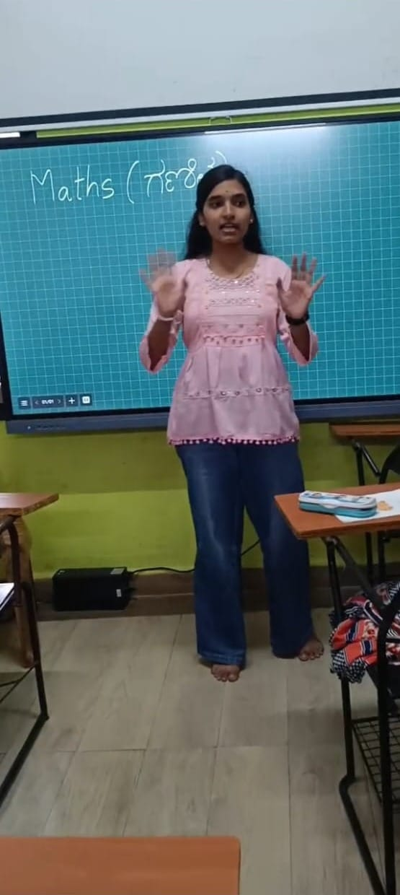

+++
title = "My First Week as an Intern: Learning to Listen Before Teaching"
date = '2026-08-22T00:26:12-07:00'
draft = false
week = 1
weight = 5
contributor = "mamta-konnuri"
role = "Teacher Intern"
emoji = "👩‍🏫"
+++



## 👩‍🏫 Mamta Konnuri

### My First Week as an Intern: Learning to Listen Before Teaching

I recently started an internship on a research project about how to teach children better through gamified methods. My role is Teacher, and my first week was less about teaching and more about meeting the children and understanding them.

I spent the week introducing myself and interacting with students from 1st to 5th standard. I invited each child to introduce themselves and join in. Some spoke up straight away. Others needed a little time and encouragement, and watching that difference taught me a lot.

#### What I observed

- **Confidence:** Some children were eager to speak, while others hesitated.
- **Participation:** Interest in joining activities varied a lot between age groups.
- **Communication:** Children expressed themselves in very different ways.
- **Attention and interest:** Engagement rose when things felt interactive and fun.
- **Willingness to learn:** Most children were curious. They just needed the right way in.

#### My biggest takeaway

A single teaching style cannot work for children of different ages and levels. A 1st standard student and a 5th standard student need very different approaches, so teaching has to be flexible and student-centred.

My approach this week was simple: **Introduction > Interaction > Observation > Understanding Students.**

I think understanding who you are teaching comes before what you are teaching. This week gave me the foundation for everything the research will build on, including making learning more interactive, visual, and engaging through games and activities.

I am excited for the weeks ahead and grateful for the chance to learn from the children as much as I teach them.

#Internship #Education #GamifiedLearning #TeachingChildren #Research #LearningByDoing #FirstWeek
