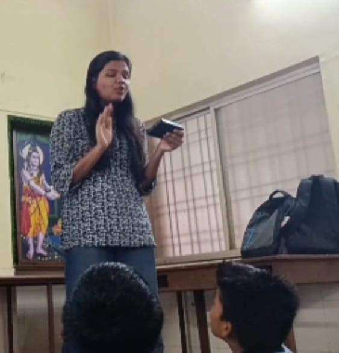

+++
title = "Classroom Observation & Research"
date = '2026-08-22T00:26:12-07:00'
draft = false
week = 1
weight = 13
contributor = "nandini-dasar"
role = "Researcher & Documentation Intern"
emoji = "🔬"
+++



## 🔬 Nandini Dasar

### Weekly Progress Report: Week 1

*Classroom Observation & Research · Researcher*

#### 1. Executive Overview & Key Focus

During Week 1, I began my work as a researcher and classroom observer on a project about how children learn best. My role was to watch closely, listen carefully, and step in only when needed to understand each student's learning difficulties and responses. I observed sessions taught by Teacher Zaveriya, noting how students took part, paid attention, understood ideas, and communicated their answers. Students arrived with very different levels of prior knowledge: some grasped concepts quickly, while others needed repeated explanations and simple examples.

#### 2. Teaching Method Observed

Teacher Zaveriya used the **PhET Interactive Simulation, Circuit Construction Kit: DC**, to teach DC circuits. Key features of the activity include:

- **Hands-on Building:** Students built circuits and experimented with components.
- **Instant Feedback:** Results were visible straight away, so students could see the effect of each change.
- **Learning from Mistakes:** The activity encouraged students to try different solutions, spot their own mistakes, and learn from them.
- **Research Alignment:** This kind of curiosity and problem-solving is exactly what our research project hopes to see.

#### 3. Key Observations

- **Participation:** Most students answered questions, used the digital resources, and tried activities on their own.
- **Attention:** Students were most interested when digital tools and practical demonstrations were used.
- **Different Speeds:** Some students could explain their learning independently, while others needed prompts and repeated explanations.
- **Language:** Simple English mixed with Kannada made students more comfortable with instructions and with giving their answers.
- **Peer Support:** Students often solved problems and understood activities better by working with classmates.

#### 4. Biggest Takeaway

Students learn best through simple explanations, real-life examples, visual and digital resources, practical activities, and repeated explanation when required. Because learners move at different speeds and need different levels of support, teaching has to be flexible. Some students were quieter and needed extra encouragement, and a little support made a clear difference to their confidence.

My approach this week was simple: **Observe > Interact > Understand > Learn from Students.**

#### 5. Classroom Session Photo

Photograph from the classroom session showing Teacher Zaveriya conducting a session, observed by Researcher Nandini.

*Figure 1.1: Teacher Zaveriya conducting a session, observed by Researcher Nandini.*

#### 6. Key Outcomes & Next Steps

Combining a teacher's explanation with digital tools and hands-on activities makes concepts easier to understand and improves participation and confidence. Thank you to Teacher Zaveriya for a session that made this so clear.

- **Flexible Teaching:** Different learners need different levels of support.
- **Digital + Practical Learning:** Simulations and demonstrations kept attention high.
- **Upcoming Focus:** Continuing to observe, learn from the students as much as from the classroom itself, and document how support affects confidence in the weeks ahead.

**Tags:** #Research #ClassroomObservation #Education #DigitalLearning #PhETSimulation #ActivityBasedLearning #FirstWeek
