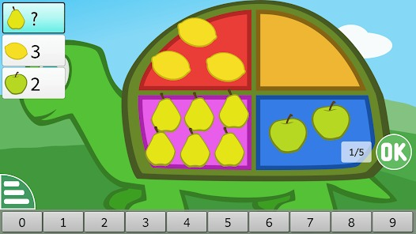

+++
title = "Exploring Technology for Interactive Learning"
date = '2026-08-22T00:26:12-07:00'
draft = false
week = 1
weight = 9
contributor = "naqeeda"
role = "Researcher & Documentation Intern"
emoji = "📚"
+++



## 📚 Naqeeda 

### Weekly Progress Report: Week 1

*Exploring Technology for Interactive Learning · Researcher & Documentation · Class 1–3*

#### 1. Executive Overview & Key Focus

As part of our internship with Swami Vivekanand Seva Pratisthan (SVSP), Belagavi, our Week 1 objective was to explore how technology can make learning more interactive and engaging for children. We used GCompris, an educational software platform, with students from Classes 1–3, focusing mainly on Mathematics and English activities, and observed how the children responded to computer-based learning.

#### 2. GCompris Activities Explored

Throughout the week, we explored different GCompris activities to observe the children's interest, confidence, understanding, and ability to complete tasks with or without guidance. Key activities include:

- **Activity Menu:** The screen where a child chooses what to open next. It depends on reading titles, recognising pictures, and using the mouse or touch confidently.
- **Counting Activity (Turtle Shell):** Children count fruits placed on a green turtle's shell, choose the answer from digits 0 to 9, and press OK. It supports counting, comparing quantities, and linking a digit with the number of objects.
- **Language Support:** Students interacted in Kannada whenever required, showing that simple instructions in their own language matter when introducing technology.

#### 3. What We Observed

**Understanding the Learning Experience**

Students showed interest in the Mathematics and English activities, but their confidence levels differed. Some were comfortable using the activities, while others needed more guidance and support.

Choosing an activity from the menu was not equally easy for everyone. Some students picked an icon on their own, while others waited for us to point one out. The small icons and the amount of English text made this step harder for younger children.

The counting activity was where the link with Mathematics was easiest to see. The pictures and colours held students' attention, and counting objects felt natural to them. Some students needed help to understand what the question mark was asking, and a few were less confident about finding and pressing the correct digit. With guidance, they were able to continue.

#### 4. Visual Representation: GCompris Activity Menu

The screenshot below shows the GCompris activity menu seen during the session, where a child chooses which activity to open.

*Figure 1.1: GCompris activity menu seen during the session.*

#### 5. Key Outcomes & Next Steps

Week 1 showed that an educational tool is not suitable simply because it contains learning activities. Its difficulty level, presentation, interaction, and age suitability must also be considered. Key conclusions include:

- **What worked:** The students showed interest in the Mathematics and English activities.
- **What was difficult:** Some activities were less colourful and less engaging, and certain ones were hard for younger students to complete on their own.
- **Start with the learner:** The needs and abilities of the learners should come first when evaluating an educational resource.
- **Keep it simple for Classes 1–3:** Activities need to be simple, colourful, interactive, and easy to understand.
- **Upcoming Focus:** Exploring simpler, more colourful, and age-appropriate learning solutions for students from Classes 1–3.

#### 6. Counting Activity Screenshot

The counting activity in which fruits are placed on the shell of a green turtle.

*Figure 1.2: GCompris counting activity observed during the session.*
