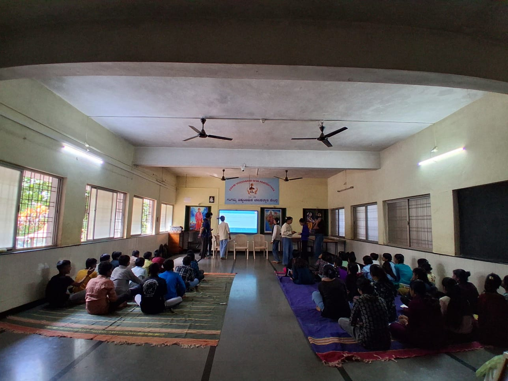

+++
title = "Video Editing, Interactive Games & Emotional Student Engagement"
date = '2026-08-22T00:26:12-07:00'
draft = false
week = 1
weight = 7
contributor = "pavitra-madiwal"
role = "Content Creator"
emoji = "🎬"
+++



## 🎬 Pavitra Madiwal

### Weekly Progress Report: Week 1

*Video Editing, Interactive Games & Emotional Student Engagement · Content Creator*

#### 1. Executive Overview & Key Focus

During Week 1, my core objective as a Content Creator was capturing, editing, and curating interactive learning experiences for young students. By integrating engaging video content with educational digital tools like Toy Theater, we created a vibrant digital environment designed to boost spatial awareness and early childhood engagement.

#### 2. Video Editing & Educational Website Work

Throughout the week, I captured raw classroom footage and edited instructional media showcasing children interacting with interactive display boards. Key accomplishments include:

- **Video Editing & Curation:** Editing high-quality instructional clips highlighting real-time student interactions with digital games.
- **Platform Integration:** Selecting age-appropriate 3D spatial navigation tools on Toy Theater (such as 'Tunnel Rush') to foster fine motor coordination.
- **Interactive Setup:** Configuring smart display boards for direct touch navigation and vibrant visual storytelling.
- **Content Documentation:** Archiving video edits to evaluate student engagement levels and refine future lesson templates.

#### 3. Heartwarming Story: The Joy of Watching Children Learn

**Pure Happiness & Emotional Fulfillment**

As a Content Creator, there is no feeling more rewarding than watching children experience the magic of interactive learning for the first time. During our session with the Toy Theater games on the smart board, the room transformed into a space of pure wonder.

Seeing the children's eyes light up with curiosity as they touched the screen, saw colors respond, and solved interactive puzzles brought overwhelming happiness to all of us. Their genuine laughter, bright smiles, and enthusiastic gasps of joy as they mastered each game fulfilled the core purpose of our work. It reminded us that content creation isn't just about screens—it's about creating moments of pure delight and spark in a child's educational journey.

#### 4. Visual Representation: Interactive Smart Board Setup

The graphic below illustrates the classroom setup featuring the smart display board, interactive 3D web games, and active student engagement.

#### 5. Key Outcomes & Next Steps

Week 1 demonstrated the incredible emotional and cognitive power of interactive media in early childhood education. Key conclusions include:

- **Emotional Engagement:** High enthusiasm and bright smiles confirmed that gamified learning drastically improves attention span.
- **Video Documentation:** Edited footage successfully captured core engagement metrics to guide upcoming lesson development.
- **Upcoming Focus:** Developing collaborative peer-to-peer interactive board tasks for Week 2.

#### 6. Classroom Session Photo

Photograph from the classroom session showing students engaging with the interactive smart board.

*Figure 1.2: Students during the interactive smart board session.*
