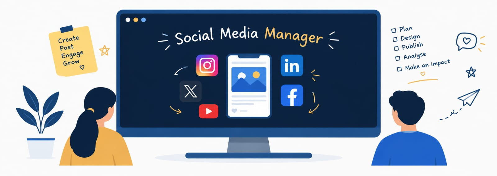

+++
title = "Building the Digital Identity Behind the Work"
date = '2026-08-22T00:26:12-07:00'
draft = false
week = 1
weight = 2
contributor = "rakshita-pawar"
role = "Social Media Manager Intern"
emoji = "📱"
+++



### A Week of building , Learing and Creating

*Building the Digital Identity Behind the Work · Social Media Manager Intern*

**EdTech Research Internship, Week 1 of 7**
**B.E. Electronics & Communication Engineering · Maratha Mandal Engineering College**
**PTHOTH × Swami Vivekanand Seva Pratisthan (SVSP), Belagavi**

*Figure 1: Social media management as a bridge between the team's work and the public.*

#### 1. Starting With the Digital Foundation

My first week at PTHOTH was focused on establishing its official digital presence. I was not assigned website development work at this stage. Instead, my responsibility as a Social Media Manager was to create and organize the official channels through which PTHOTH would eventually communicate its work.

The work included setting up the official email and recovery email, creating the public Instagram account, and establishing official profiles on Facebook, Twitter/X and GitHub. Although creating an account may seem simple, an organizational account needs to be created with long-term use, security, consistency and accessibility in mind.

#### 2. More Than Just Creating Accounts

Week 1 helped me understand that social media management is not limited to posting pictures or writing captions. A Social Media Manager helps build the identity through which people see an organization.

**Work happening inside → Understanding it → Communicating it → Public perception**

This means understanding what different teams are doing, deciding what information is useful for communication, maintaining a consistent identity across platforms, and making sure that what reaches the public represents PTHOTH accurately.

#### 3. Being the Face of Everyone's Work

One of the deeper challenges I noticed was that social media is connected to almost every other team. Researchers, teachers, media members, IT members and other interns may all be working on different activities, while the social-media team is responsible for helping make that work visible.

This can create coordination challenges. Information may arrive late, details may still be changing, images may not be ready, or different people may have different understandings of what is final. These situations taught me that many apparent 'conflicts' are actually coordination gaps. The role requires patience, follow-up and clear communication.

> **I began to ask not only 'What should I post?', but also 'What information do I need, from whom, and when, so that I can represent the team's work correctly?'**

*Figure 2: The learning environment that the digital presence ultimately represents.*

#### 4. What I Learned in Week 1

My first week changed my understanding of the Social Media Manager role. I learned that a strong digital presence begins before the first post—with proper account setup, recovery, consistency and coordination.

I also understood that I am not communicating only my own work. I am helping represent the work of an entire internship team. That makes accuracy and responsible communication important, because the public often sees the organization through the way its work is presented online.

**Key takeaways:**

- **Digital identity** needs structure
- **Communication** needs understanding
- **Social media** requires teamwork
- **Consistency** builds trust
- **Accurate representation** matters

#### 5. Looking Ahead

Week 1 gave me the foundation for the work ahead. The official channels were established, but I also realized that managing them would require much more than uploading content. I would need to understand PTHOTH's work, coordinate with different teams, maintain its identity and communicate its educational purpose clearly.

> **Social media is not just where the work is posted. It is where the work becomes visible.**

*Written by Rakshita Pawar, Social Media Manager Intern · PTHOTH Labs × SVSP, Belagavi*
