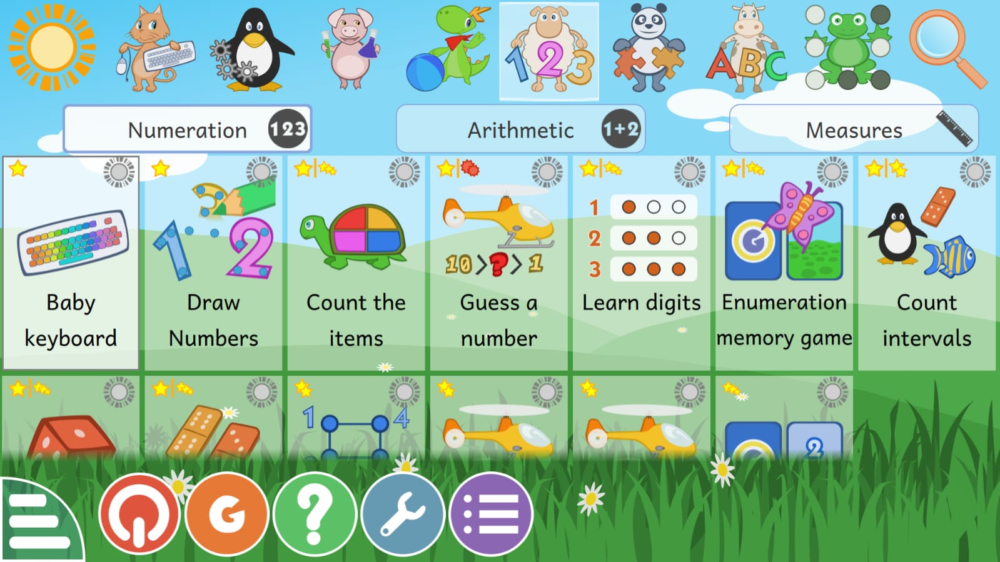

+++
title = "Digital Literacy and Learning Outreach: An Internship Experience with GCompris-Based Learning"
date = '2026-08-22T00:26:12-07:00'
draft = false
week = 1
weight = 3
contributor = "tazeen-maldar"
role = "Researcher & Documentation"
emoji = "🔍"
+++



## 📋 Tazeen Maldar
### My First Internship Begins – Stepping into the Role of a Researcher & Documentation

### Digital Literacy and Learning Outreach: An Internship Experience with GCompris-Based Learning

*Swami Vivekanand Seva Pratishthan | Digital Literacy & Learning Outreach Programme*

#### Introduction

As part of my internship experience with Swami Vivekanand Seva Pratishthan, I had the opportunity to observe and document classroom learning sessions conducted under the organisation's Digital Literacy & Learning Outreach Programme. The sessions focused on using GCompris, a free and open-source educational software suite, to support foundational learning in English and Mathematics among Class 1 students.

The experience provided an opportunity to understand how digital tools can be incorporated into classroom education, particularly for young learners. Along with observing students' interaction with the software, I studied their engagement, participation, confidence, effort, ability to explain concepts and improvement during the sessions.

*The GCompris main menu*

#### The Internship Experience

During the internship, I was involved in classroom observation and documentation of two GCompris-based learning sessions conducted on 25 July 2026 and 1 August 2026. The first session had 13 students, including 8 boys and 5 girls, while the second session had 14 students, including 9 boys and 5 girls.

A structured observation approach was used to record student performance. The boys were assessed across six parameters: Improvement, Engagement, Participation, Ability to Explain the Concept, Effort and Confidence, using a 1–5 scale. Girls' participation and overall classroom dynamics were also captured as secondary observations.

#### Observing Digital Learning in the Classroom

One of the most interesting aspects of the internship was seeing how children interacted with digital learning activities. Students worked with GCompris activities related mainly to English and Mathematics. These were among the most popular subject areas, while most students preferred communicating in Kannada during the sessions.

In the first session, five out of eight boys were fully confident and comfortable answering questions and engaging throughout the activity. In the second session, six out of nine boys interacted confidently and consistently. The second session also showed better overall focus, attention and task completion.

*GCompris Numeration activities used for Mathematics*

#### Key Observations and Learning

A significant learning from the internship was that engagement with technology does not always mean complete conceptual understanding. Although students were able to perform activities successfully during the sessions, some struggled to remember what they had learned afterwards.

During the second session, spelling and pronunciation mistakes were observed after the session. This suggested that some students might have been copying or mimicking actions and answers rather than fully understanding the concepts. Several students also struggled to differentiate between capital and small letters, particularly within the early-grade range.

These observations highlighted the importance of combining digital activities with explanation, questioning, revision and reinforcement so that students can move from simply completing an activity to actually understanding and retaining the concept.

#### Challenges Observed

The internship also helped identify challenges associated with using educational technology in classrooms. Some GCompris activities were not colourful or playful enough for the students, which reduced enjoyment and engagement. Certain games also did not operate properly and required technical review.

Teacher preparedness was another concern noted during the observations. Facilitating teachers were not adequately prepared for one of the sessions, showing the importance of proper preparation when introducing technology into classroom teaching.

Language was also an important factor. Since most students interacted in Kannada, future facilitation could take this preference into account when explaining instructions and concepts.

*More GCompris activity categories*

#### Skills and Knowledge Gained

This internship helped me develop practical skills in classroom observation, documentation and structured data collection. I gained experience in analysing student engagement and participation, identifying learning difficulties, interpreting qualitative observations and preparing a structured report from classroom data.

The experience also strengthened my understanding of educational technology. I learned that successful digital learning requires more than access to software: it also depends on appropriate content, teacher preparation, student confidence, technical reliability and regular assessment of learning and retention.

#### Recommendations and Future Scope

Based on the observations, several improvements could make future sessions more effective. These include reviewing and fixing GCompris games that do not operate correctly, exploring more colourful and playful modules, and introducing a short pre-session briefing or checklist for teachers.

A brief recap quiz at the beginning of each new session could help measure retention of spelling, pronunciation and capital/small letter concepts. Individual follow-up can also be provided to students who show lower confidence or participation.

For stronger evaluation in future sessions, the programme could record individual-level scores for girls as well, conduct delayed retention checks 24–48 hours after sessions, and maintain consistent typed data immediately after each session.

#### Conclusion

My internship experience with Swami Vivekanand Seva Pratishthan gave me valuable insight into the practical use of digital technology in elementary education. Observing students use GCompris showed that interactive digital tools can encourage participation, confidence and classroom engagement.

At the same time, the sessions demonstrated that technology alone cannot guarantee learning or long-term retention. Effective digital education requires suitable content, prepared teachers, regular reinforcement and attention to the individual needs of learners.

Overall, the internship was a meaningful learning experience that allowed me to connect technology with education while developing practical skills in observation, analysis, documentation and reporting.
