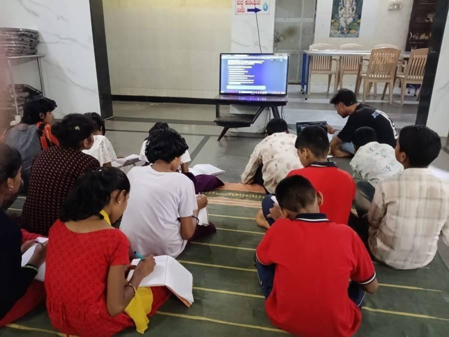
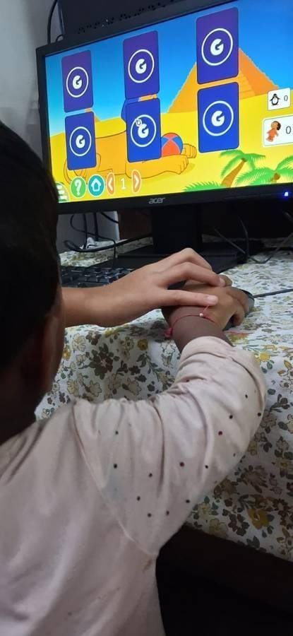

+++
title = "Starting My EdTech Research Internship as an IT Manager"
date = '2026-08-22T00:26:12-07:00'
draft = false
week = 1
weight = 1
contributor = "ummehabiba-kotwal"
role = "IT Manager Intern"
emoji = "💻"
+++



### Starting My EdTech Research Internship as an IT Manager

### Starting My EdTech Research Internship as an IT Manager

*IT Manager Intern · EdTech Research Internship

Starting my EdTech Research Internship with Pthoth, in collaboration with Swami Vivekanand Seva Pratisthan (SVSP), Belagavi, was different from a conventional internship where the focus is only on developing software.

The objective of this internship is to understand how technology can support children's learning while also studying their needs, interests and interaction with educational tools.

During the orientation, I understood that the internship was structured almost like a small organization. Interns were given different responsibilities and were expected to take ownership of their roles. The roles included areas such as research, teaching, social media, media generation, management and IT.

I was assigned the role of IT Manager.

*A group learning session with students*

#### Understanding My Role

My responsibilities included much more than simply installing software. I was expected to:

- Install and configure educational software.
- Prepare computers before learning sessions.
- Check whether software works properly on the available hardware.
- Troubleshoot technical problems.
- Evaluate whether educational tools are practical for children.
- Make software easier for students to access independently.
- Research hardware and operating-system requirements.
- Maintain technical documentation.
- Support future website and application development.
- Study hosting and deployment requirements when necessary.

**IT Manager → Software → Hardware → Testing → Documentation → Research**

This helped me understand that an IT role in an educational environment involves both technical implementation and decision-making.

*An intern showing a laptop to a group of students*

#### Why Free and Open-Source Software?

One of the important concepts introduced during the internship was the use of free and open-source educational solutions.

*GCompris, one of the free and open-source educational tools considered*

At first, I understood "free" mainly as software that does not require payment. During the internship, I learned that free software and open-source software are not necessarily the same thing.

Open-source software provides access to its source code under its license, allowing permitted users to study, modify and redistribute it according to the license terms. This can be particularly useful for educational projects because organizations can examine, adapt and maintain suitable tools without being completely dependent on a commercial vendor.

Cost was also an important practical consideration because the goal was to find solutions that could be used with limited resources.

*Guided practice with GCompris: a helping hand on the mouse*

Therefore, our evaluation was not simply:

> *"Is this software free?"*

It was more about: **Can this tool be used safely, practically and sustainably in our educational environment?**

#### What I Learned During Week 1

This first week changed my understanding of the role of an IT manager.

I learned that choosing technology requires looking at the complete environment — hardware, software, users, security, accessibility, maintenance and long-term feasibility.

Instead of immediately asking "Can we install this?", I started thinking:

> *"Should we install this, will it work on our systems, is it appropriate for the students, and can it be maintained?"*

That became the foundation for the technical work I carried out in the following weeks.

*Written by Ummehabiba Akeelahmed Kotwal, IT Manager Intern. IT Manager internship with Pthoth in collaboration with Swami Vivekanand Seva Pratisthan (SVSP), Belagavi.*
