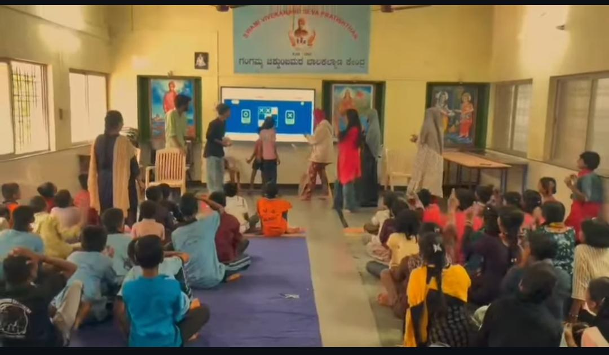
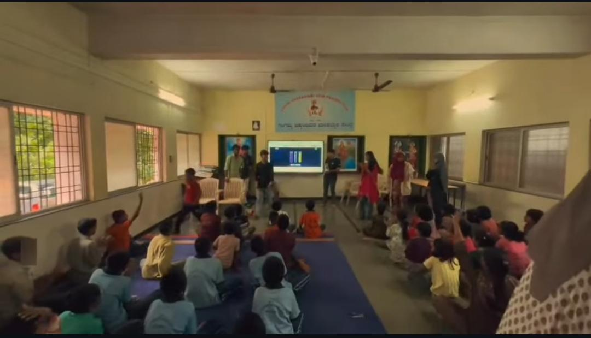

+++
title = "Beginning My Internship Journey"
date = '2026-08-22T00:26:12-07:00'
draft = false
week = 1
weight = 10
contributor = "varshini-gudigar"
role = "POC Manager"
emoji = "🤝"
+++



## 🤝 Varshini Gudigar

### Weekly Progress Report: Week 1

*Beginning My Internship Journey · Point of Contact (POC) Manager*

#### 1. Executive Overview & Key Focus

Starting my internship as a Point of Contact (POC) Manager was a new and exciting experience. My core objective in Week 1 was to communicate with teachers, researchers, and students, understand their experiences, and create a comfortable environment for interaction.

#### 2. Getting to Know the Students

During the first week, we introduced ourselves to the students and tried to get to know them. Key accomplishments include:

- **Friendly Introductions:** Keeping interactions informal so students felt comfortable and could communicate without hesitation.
- **Games & Fun Time:** Talking, playing games, and spending time together to help students feel happy, comfortable, and more confident.
- **Growing Openness:** Seeing students gradually become more open and involved in the activities.

#### 3. Learning Through Games and Fun Activities

**Learning Together**

Learning does not always have to happen in a serious or formal way. Games and fun activities helped us interact with the students more easily and made them more willing to participate.

We also taught the students while learning along with them. Their questions, responses, and ideas made the interactions more interesting and gave us opportunities to learn from them as well. The experience felt less like simply teaching and more like learning and having fun together.

#### 4. Visual Representation: Interactive Screen-Based Activity

The photograph below shows students and volunteers taking part in an interactive screen-based activity.

*Figure 1.1: Students and volunteers taking part in an interactive screen-based activity.*

#### 5. Key Outcomes & Next Steps

As a POC Manager, I encouraged students to express themselves and take part without worrying about making mistakes. I also communicated with teachers and researchers whenever possible, which helped me understand different perspectives. Key conclusions include:

- **Comfort & Confidence:** Friendly, informal introductions help students feel comfortable and confident.
- **Participation:** Games and fun activities make students more willing to participate.
- **Two-Way Learning:** Teaching is a two-way process; we learned from the students' questions and ideas.
- **Safe Space:** A space without fear of mistakes encourages self-expression.
- **Added Perspectives:** Talking with teachers and researchers added valuable perspectives.

> *"Learning becomes more meaningful when we learn, teach and have fun together."*

#### 6. Classroom Session Photo

Photograph from the classroom session showing students seated together, engaged in a group activity led by the team.

*Figure 1.2: Students seated together, engaged in a group activity led by the team.*
