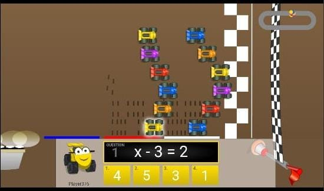

+++
title = "My First Internship Begins – Stepping into the Role of a Teacher"
date = '2026-08-22T00:26:12-07:00'
draft = false
week = 1
weight = 11
contributor = "vishwas-karikatti"
role = "Teacher Intern"
emoji = "🤖"
+++



## 🤖 Vishwas Karikatti

### Week 1: My First Internship Begins – Stepping into the Role of a Teacher

*Teacher Intern · Robotics and Artificial Intelligence · Maratha Mandal Engineering College*
*Pthoth, in collaboration with Swami Vivekanand Seva Pratisthan (SVSP), Belagavi*

#### 1. Introduction

My name is Vishwas Karikatti and I am a student of Robotics and Artificial Intelligence at Maratha Mandal Engineering College. I have begun my first internship as a Teacher Intern at Pthoth, in collaboration with Swami Vivekanand Seva Pratisthan (SVSP), Belagavi.

Standing in front of a classroom for the first time changes how you think about learning. Until now I had only been on the receiving end of teaching, and this week I started to see it from the other side. This internship is a step from the world of engineering studies into real, hands-on responsibility, where the aim is to help students understand concepts in a way they can connect with.

#### 2. Objectives

The objectives of my internship, as I understood them in the first week, are:

- To understand what the role of a teacher involves beyond explaining a topic.
- To plan and deliver simple, engaging lessons that students can relate to.
- To make mathematics and general learning enjoyable through activities, games and technology.
- To encourage students to participate, ask questions and learn from their mistakes.
- To develop communication, patience and classroom management skills.
- To experience professional responsibilities such as punctuality, teamwork and receiving feedback.

#### 3. My Role and Responsibilities

I was assigned the role of Teacher Intern. My responsibilities include:

- Preparing lessons and deciding what the students should take away from each session.
- Guiding students through learning activities and interactive tools.
- Using the smart board and online resources to make concepts visual and easy to follow.
- Asking questions, involving the students and observing how they respond.
- Supporting students who find a concept difficult and explaining it in a different way.
- Planning with the team, taking guidance from mentors and acting on feedback.

#### 4. Understanding My Role

In the first week, I focused on understanding what being a teacher actually involves. I realised quickly that teaching is not just explaining a topic. It means knowing your students, adjusting your pace to them, and making sure that what you say is understood and not merely heard.

Coming from a Robotics and Artificial Intelligence background, I am used to thinking in terms of logic, systems and problem solving. I found that the same mindset helps in teaching: break a big idea into small steps, check that each step works, and then build on it.

#### 5. Activities Undertaken

During the first week, the students took part in a range of interactive learning activities in the hall of the Kendra, supported by the smart board and online learning resources.

##### 5.1 Classroom Interaction

Sessions were held with the students seated together on mats in the hall. I used questions throughout the session to keep everyone involved, and the students responded enthusiastically, with many hands going up to answer. Interacting directly with the group helped me see which ideas were clear and which needed another example.

*Figure 1: Students eagerly raising their hands to answer questions during a session.*

##### 5.2 Interactive Simulation: PhET Number Pairs

I used the PhET "Number Pairs" simulation on the smart board so that students could work with numbers visually instead of only listening to an explanation. Students came up to the board one by one and tried the activity themselves, while the rest of the group watched and discussed. Learning by doing kept the students attentive and made the idea easier to remember.

*Figure 3: A student solving the PhET Number Pairs activity on the smart board.*

##### 5.3 Maths Games: Math Playground

To make practice more enjoyable, I explored games from Math Playground that turn algebra into a challenge. In one game, students multiply algebraic terms such as (6y)(−1y) and guide a character to the platform showing the correct answer. In another, a racing game, students solve simple equations such as x − 3 = 2 to move their car forward. These games let students practise skills repeatedly without feeling it is a drill.

*Figure 4: Multiplying algebraic terms game.*

*Figure 5: Equation-solving racing game.*

##### 5.4 Quizzes and Knowledge Activities

Along with maths, I explored the quizzes, puzzles and videos section of National Geographic Kids as a way to bring general knowledge and curiosity about animals and the world into the learning sessions. Quizzes are a good way to check understanding in a light, low-pressure manner.

#### 6. Preparing and Delivering Lessons

Preparation turned out to be as important as the lesson itself. Before each session, I had to decide what the students should take away, how to introduce the topic simply, and which examples would make it relatable.

Some key things I learned this week:

- Starting with a simple, familiar example before introducing the formal idea.
- Using questions to involve students instead of speaking continuously.
- Keeping explanations short, clear and in plain language.
- Encouraging students to try activities themselves rather than only watch.
- Using games and simulations to turn practice into something students look forward to.
- Watching faces and responses to know when to slow down or repeat.

#### 7. Connecting with Students

The most valuable lesson of the week was about communication. Students respond very differently: some ask questions freely, while others stay quiet even when they are confused. I learned that patience and a friendly approach make students more comfortable, and that a quiet student is not necessarily an understanding one.

I also noticed that mistakes in the classroom are useful. When a student gives a wrong answer, it shows me exactly where the confusion lies, and that helps me explain better the next time.

#### 8. Learning Through My First Experience

Since this was my first internship, I also got a glimpse of professional responsibilities such as punctuality, teamwork, and taking guidance from mentors. Planning with the team and receiving feedback helped me see where I can improve.

I realised that teaching needs patience, clarity, adaptability and confidence. Confidence grows only with practice, and even small improvements, such as asking a better question or giving a clearer example, make a visible difference.

#### 9. Resources and Reference Links

The following links were used as reference and learning resources during the week:

- [Resource 1](https://share.google/0aqfop7T59uAMzGgE)
- [Resource 2](https://share.google/s7UCMz4ZFenalFxzh)

#### 10. My Key Takeaway

My first week was an introduction to the responsibility and joy of teaching. It showed me that a good teacher is not the one who knows the most, but the one who helps others understand. I learned the importance of preparation, patience and clear communication, and I am looking forward to improving my teaching skills, learning from my students, and gaining more practical experience in the weeks ahead.
