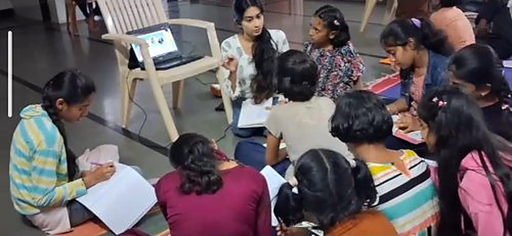
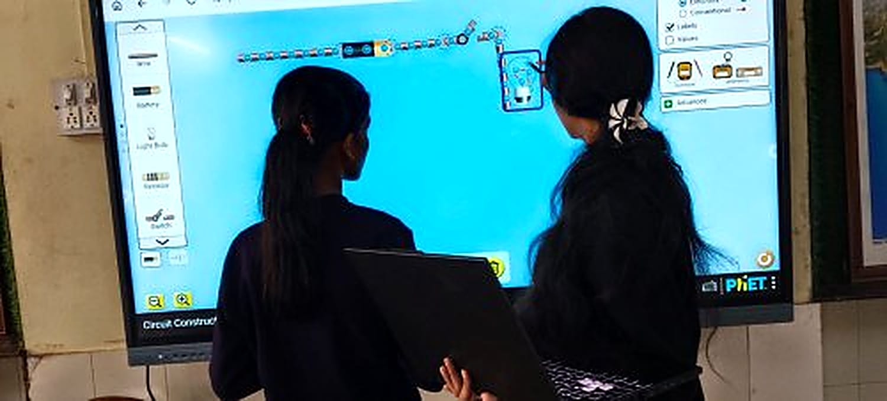
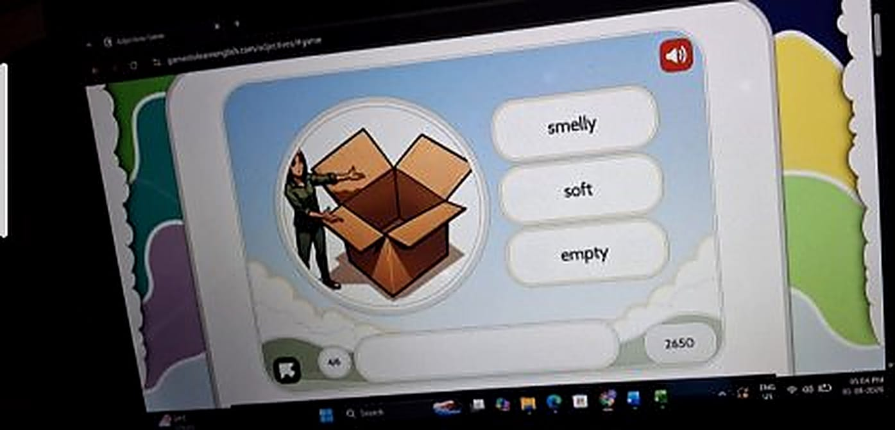

+++
title = "Using Educational Technology to Support Learning"
date = '2026-08-22T00:26:12-07:00'
draft = false
week = 1
weight = 6
contributor = "zaveriya-baig"
role = "Teacher Intern"
emoji = "👩‍🏫"
+++



## 🎓 Zaveriya Baig

### Teacher Intern at Pthoth & SVSP: Using Educational Technology to Support Learning

*Computer Science Engineering  · Internship start: 
*Pthoth in partnership with Swami Vivekanand Seva Pratisthan (SVSP), Belagavi · 

#### 1. Introduction

Being a Computer Science Engineering student, my college life revolves around programming, technical concepts and academic projects. This internship allowed me to step outside that environment and learn about children, their needs and the role of technology in making learning enjoyable. Teaching, I discovered, is not just explaining a topic; it means knowing students, identifying their problems, choosing the mode of learning and adapting to their needs.

#### 2. Objectives of the Internship

- To understand how educational technology can be chosen and used with the learner's needs in mind.
- To plan and conduct learning sessions for children of Classes 9 and 10.
- To explore interactive platforms and games for mathematics, science, English and social science.
- To develop communication, teamwork and classroom-management skills.

#### 3. Role and Responsibilities

As a Teacher Intern, my responsibilities were:

- Planning and conducting sessions with researchers Shreya and Nandini
- Exploring educational resources and platforms
- Explaining concepts and encouraging children
- Observing students' difficulties and progress
- Deciding how an activity could run on the available hardware

Preparation proved to be an important part of teaching: I had to be familiar with each resource and anticipate its difficulties. At the same time, much of teaching has to be adapted on the spot.

#### 4. Activities Undertaken

Students showed more interest when learning involved games, activities and illustrations. Every activity was planned with a clear learning purpose, since technology should never be used merely for its own sake. The table below summarises the subjects, topics and platforms.

| Subject | Topics / modules | Platform |
|---|---|---|
| Mathematics | Multiplication and division, rules of signs, order of operations (BODMAS), multi-step problems | MathGames.org, GeoGebra |
| Mathematics | Multiplication, factors and division | PhET Arithmetic |
| Mathematics | Arithmetic progression | MathWorksheetsFun games |
| Science | DC circuits; pH scale | PhET simulations |
| Science | Human heart and blood circulation | SciChamp game and a Kannada video |
| English | Vocabulary, spelling, listening and word games | Games to Learn English, VOA Learning English, Fun English Games |
| Social science | Capital to State | DeshKit games |

##### Mathematics: Order of Operations (Classes 9 and 10)

The main objective of this session was to help students of Classes 9 and 10 understand and apply the order of operations while solving multi-step problems. I prepared it with researchers Shreya and Nandini, and used GeoGebra and MathGames.org.

Before the main topic I assessed the students' basic understanding with simple multiplication and division questions. Some students were not confident with these basic operations, so I adjusted my plan and strengthened them first instead of moving straight to BODMAS. I realised that before introducing a higher-level concept, it is important to check that students have the prerequisite concepts.

I then introduced the rules of signs: when the signs are the same the result is positive, and when they are different the result is negative. After that I introduced BODMAS, demonstrated multi-step problems step by step, let students practise similar problems independently, and finished with game-based practice on MathGames.org.

**Teaching sequence:** Basic operations → rules of signs → BODMAS → multi-step problems → practice → MathGames.org games.

| Sign rule | Result |
|---|---|
| + and + (same signs) | + |
| - and - (same signs) | + |
| - and + (different signs) | - |
| + and - (different signs) | - |

##### GeoGebra: Equations, Order of Operations and Coordinates

For Classes 9 and 10 I used GeoGebra for three topics: solving simple one-step equations, order of operations in multi-step problems, and plotting points on the coordinate plane. Each topic followed the same approach: a real-life example, explanation, GeoGebra demonstration, student interaction or activity, discussion, practice and assessment.

For equations, the objective was that children understand what an equation is and find the unknown value x in a one-step equation. I started with a real-life example: if I have some chocolates and get 3 more, and the total is 8, how many did I have before? Then I introduced x + 3 = 8, explained that x is the unknown, and asked students how they got their answers. If a child found it difficult, I explained again with simpler examples, and ended by giving each student one or two questions to check understanding.

I used simple English, Hindi and Kannada words so the children could follow, and a simple 10-minute pre-test at the start and a 10-minute post-test at the end to check learning. My main aim was that children understand the concept and enjoy learning maths.

##### PhET Arithmetic: Multiplication, Factors and Division

Using the PhET Arithmetic simulation, I explained multiplication through visual representation instead of only formulas. I then introduced factors by giving numbers and asking students to find the possible multiplication pairs, and connected factors with division so they could see that multiplication and division are related. Students solved small challenges themselves in PhET, worked in pairs or groups, and answered a few quick questions at the end.

**Approach:** basic assessment, concept introduction, PhET exploration, guided practice, interactive challenges, quick assessment.

*PhET Arithmetic factors activity on the smart board*

##### Arithmetic Progression and Binary Numbers

For arithmetic progression I started with simple sequences such as 2, 4, 6, 8, 10 and asked students what differs between the terms, so they worked out the common difference themselves. Students then practised on MathWorksheetsFun games (Balloon Pop, Space Shooter, Race Car, Matching Pairs and Pattern Blaster), starting at Easy and moving to Medium or Hard according to performance. After each activity I went over answers and explained errors, especially wrong common differences or patterns.

For binary numbers I used the Binary Bulbs activity on GeoGebra, with 0 as OFF and 1 as ON. I showed examples of converting decimal numbers 0 to 15 into binary, and students switched the bulbs themselves to make each number. The approach was: explain, demonstrate, interactive practice, game, quick assessment.

*Students taking part in a group learning session*

##### Science: DC Circuits, Human Heart and pH

**DC circuits:** students used the PhET Circuit Construction Kit (DC) through interactive, simulation-based learning, building circuits with a battery, wires, resistor and bulb on the smart board.

**Human heart:** I began with simple questions about heartbeat and blood, then showed a Kannada explanation video for basic understanding. Students explored the heart and blood circulation in the SciChamp game, named the heart chambers and followed the path of blood, and I finished with three or four quick questions. Students gained an understanding of the basic structure of the heart and how blood circulates.

**pH scale:** I began with common examples such as lemon juice, water and soap, and briefly introduced acidic, neutral and basic substances. Students explored the PhET pH Scale simulation, observed different pH values and classified substances as acidic, neutral or basic. They came to understand the pH scale and could identify acidic, neutral and basic substances.

*Building a circuit on the smart board with PhET Circuit Construction Kit*

##### English: Testing Free Learning Websites

I tested free English learning websites with children on PCs and touchscreen devices to observe their engagement, ease of use and learning experience.

| Website | Observations |
|---|---|
| Games to Learn English | Children enjoyed vocabulary and spelling games most. Games were simple and interactive with bright visuals. Some younger children needed help reading instructions. |
| VOA Learning English | Audio and videos helped listening skills and pronunciation. Older children were more interested; some lessons were hard for beginners who lacked basic reading skills. |
| Fun English Games | Children enjoyed quizzes, puzzles and word games, which encouraged teamwork. Easy to navigate on PC and touchscreen; some games were challenging for younger children. |

Overall, interactive games kept children interested, they learned new words while having fun, and touchscreens made it easier for younger children to take part. Vocabulary and matching games were the most popular, and many children asked to play again. What did not work as well: some games needed reading instructions first, younger children needed teacher support, and a few advanced activities were less engaging for beginners. These websites can be used regularly to build vocabulary, listening, spelling and communication skills.

*Online adjectives game for English vocabulary*

##### Social Science Sessions for Classes 9 and 10

In the last two weeks I also taught social science to Classes 9 and 10 using free browser games from DeshKit (deshkit.com/games), which cover geography, culture and history and need no sign-up or download. I prepared the lesson plan with researcher Nandini. The main lesson used the Capital to State game, which reverses the usual direction: instead of naming a state's capital, students recall the state from its capital, which is harder.

| Lesson step | What it involved |
|---|---|
| Introduction | Explain the twist: students recall the state from the capital. |
| Demo | Play a few sample questions together on screen. |
| Practice | Students play individually or in pairs and note down the capitals they miss. |
| Peer quiz | Pairs quiz each other using the questions they missed. |
| Exit ticket | Each student writes two questions in the same format. |

Other games from the same site were lined up to extend the topic:

- **Geography:** Capital to State, reversed recall of states and capitals.
- **Culture:** Indian Food to State or Festival to State, linking geography to everyday culture.
- **History:** Freedom Movement Timeline, sequencing key events, useful for Class 10 history and civics.
- **Bonus for faster groups:** Indian States Border Game, spatial recall of state boundaries.

#### 5. Observations about Students

Some students struggled with basic concepts such as multiplication, division and the order of operations. This showed that foundational concepts must be secure before higher-level topics are taught. Every student learns at their own pace: some grasp a concept quickly, while others need more practice and explanation.

**Key observations**

- **What worked:** interactive and game-based activities. Students were more interested when they could solve questions by playing rather than just listening.
- Students participated more when I asked simple questions and involved them directly.
- Using websites and games for practice made sessions more engaging.
- **What did not work:** long explanations and theory-heavy teaching made some students lose interest.
- Some students have weak basics in multiplication, division and basic calculation, so more time is sometimes needed on fundamentals before the main topic.
- **Overall:** a combination of short explanation, activity or game, and practice works best.

#### 6. Challenges Faced

| Challenge | How I handled it |
|---|---|
| Unreliable Wi-Fi; websites load slowly | Used my mobile hotspot as a backup. |
| Smart board gets stuck or glitches | Waited or restarted, or explained the activity orally while it was fixed. |
| Interactive websites take time to load and eat into session time | Opened the websites in advance whenever possible. |
| Students prefer interactive activities over long manual problem solving or quizzes | Let students come to the smart board to play and use the simulations themselves. |
| Not enough laptops for every student | Gave turns one by one or in small groups. |
| Students rush to the smart board at once and do not always follow turn-taking | Called students one by one or in small groups so everyone got a turn. |
| Some students do not listen to instructions and want to start playing | Kept instructions short and explained them while demonstrating on the smart board. |
| Varying learning levels | Gave simple examples and individual help to students who needed basic explanation. |
| Limited Kannada fluency | Used simple English, Hindi and Kannada words, demonstrations and activities, with teammates helping to translate. |

 

#### Resources and Links

| Resource | Link |
|---|---|
| GeoGebra - Equations | [geogebra.org/math/equations](https://www.geogebra.org/math/equations) |
| GeoGebra - Order of operations | [geogebra.org/math/order-operations](https://www.geogebra.org/math/order-operations) |
| GeoGebra - Coordinates | [geogebra.org/math/coordinates](https://www.geogebra.org/math/coordinates) |
| PhET - Circuit Construction Kit (DC) | [phet.colorado.edu/sims/html/circuit-construction-kit-dc](https://phet.colorado.edu/sims/html/circuit-construction-kit-dc) |
| PhET - Arithmetic | [phet.colorado.edu/en/simulations/arithmetic](https://phet.colorado.edu/en/simulations/arithmetic) |
| PhET - pH Scale Basics | [phet.colorado.edu/en/simulations/ph-scale-basics](https://phet.colorado.edu/en/simulations/ph-scale-basics) |
| SciChamp - Circulatory system game | [scichamp.com/circulatory-system-game](https://scichamp.com/circulatory-system-game) |
| MathWorksheetsFun - Arithmetic sequences | [mathworksheetsfun.com/games/9th-grade-games/arithmetic-sequences](https://www.mathworksheetsfun.com/games/9th-grade-games/arithmetic-sequences) |
| Games to Learn English | [gamestolearnenglish.com](https://gamestolearnenglish.com) |
| VOA Learning English | [learningenglish.voanews.com](https://learningenglish.voanews.com) |
| Fun English Games | [funenglishgames.com](https://funenglishgames.com) |
| DeshKit games | [deshkit.com/games](https://deshkit.com/games) |
| MathGames.org | [mathgames.org](https://mathgames.org) |
