+++
date = '2026-08-22T00:26:12-07:00'
draft = false
title = 'First Journals'
members = ["timothy-unkert"]
+++

 

<strong>💻 Ummehabiba Akeelahmed Kotwal</strong> — IT Manager Intern

### Starting My EdTech Research Internship as an IT Manager

### Starting My EdTech Research Internship as an IT Manager

*IT Manager Intern · EdTech Research Internship

Starting my EdTech Research Internship with Pthoth, in collaboration with Swami Vivekanand Seva Pratisthan (SVSP), Belagavi, was different from a conventional internship where the focus is only on developing software.

The objective of this internship is to understand how technology can support children's learning while also studying their needs, interests and interaction with educational tools.

During the orientation, I understood that the internship was structured almost like a small organization. Interns were given different responsibilities and were expected to take ownership of their roles. The roles included areas such as research, teaching, social media, media generation, management and IT.

I was assigned the role of IT Manager.

*A group learning session with students*

#### Understanding My Role

My responsibilities included much more than simply installing software. I was expected to:

- Install and configure educational software.
- Prepare computers before learning sessions.
- Check whether software works properly on the available hardware.
- Troubleshoot technical problems.
- Evaluate whether educational tools are practical for children.
- Make software easier for students to access independently.
- Research hardware and operating-system requirements.
- Maintain technical documentation.
- Support future website and application development.
- Study hosting and deployment requirements when necessary.

**IT Manager → Software → Hardware → Testing → Documentation → Research**

This helped me understand that an IT role in an educational environment involves both technical implementation and decision-making.

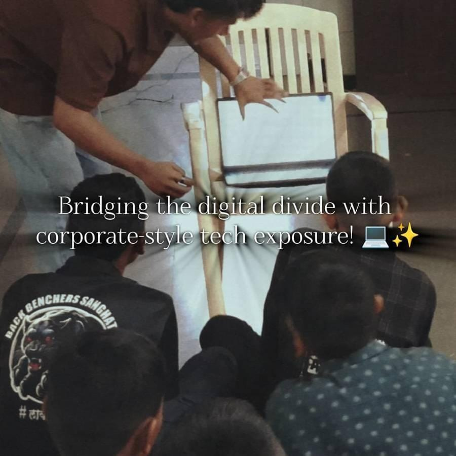

*An intern showing a laptop to a group of students*

#### Why Free and Open-Source Software?

One of the important concepts introduced during the internship was the use of free and open-source educational solutions.

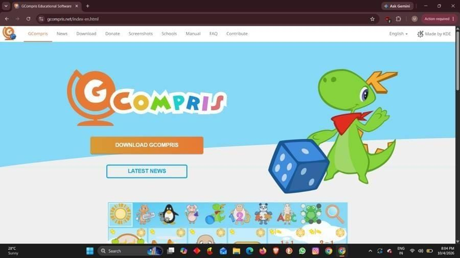

*GCompris, one of the free and open-source educational tools considered*

At first, I understood "free" mainly as software that does not require payment. During the internship, I learned that free software and open-source software are not necessarily the same thing.

Open-source software provides access to its source code under its license, allowing permitted users to study, modify and redistribute it according to the license terms. This can be particularly useful for educational projects because organizations can examine, adapt and maintain suitable tools without being completely dependent on a commercial vendor.

Cost was also an important practical consideration because the goal was to find solutions that could be used with limited resources.

*Guided practice with GCompris: a helping hand on the mouse*

Therefore, our evaluation was not simply:

> *"Is this software free?"*

It was more about: **Can this tool be used safely, practically and sustainably in our educational environment?**

#### What I Learned During Week 1

This first week changed my understanding of the role of an IT manager.

I learned that choosing technology requires looking at the complete environment — hardware, software, users, security, accessibility, maintenance and long-term feasibility.

Instead of immediately asking "Can we install this?", I started thinking:

> *"Should we install this, will it work on our systems, is it appropriate for the students, and can it be maintained?"*

That became the foundation for the technical work I carried out in the following weeks.

*Written by Ummehabiba Akeelahmed Kotwal, IT Manager Intern. IT Manager internship with Pthoth in collaboration with Swami Vivekanand Seva Pratisthan (SVSP), Belagavi.*

<strong>📱 Rakshita Pawar</strong> — Social Media Manager Intern

### A Week of building , Learing and Creating

*Building the Digital Identity Behind the Work · Social Media Manager Intern*

**EdTech Research Internship, Week 1 of 7**
**B.E. Electronics & Communication Engineering · Maratha Mandal Engineering College**
**PTHOTH × Swami Vivekanand Seva Pratisthan (SVSP), Belagavi**

*Figure 1: Social media management as a bridge between the team's work and the public.*

#### 1. Starting With the Digital Foundation

My first week at PTHOTH was focused on establishing its official digital presence. I was not assigned website development work at this stage. Instead, my responsibility as a Social Media Manager was to create and organize the official channels through which PTHOTH would eventually communicate its work.

The work included setting up the official email and recovery email, creating the public Instagram account, and establishing official profiles on Facebook, Twitter/X and GitHub. Although creating an account may seem simple, an organizational account needs to be created with long-term use, security, consistency and accessibility in mind.

#### 2. More Than Just Creating Accounts

Week 1 helped me understand that social media management is not limited to posting pictures or writing captions. A Social Media Manager helps build the identity through which people see an organization.

**Work happening inside → Understanding it → Communicating it → Public perception**

This means understanding what different teams are doing, deciding what information is useful for communication, maintaining a consistent identity across platforms, and making sure that what reaches the public represents PTHOTH accurately.

#### 3. Being the Face of Everyone's Work

One of the deeper challenges I noticed was that social media is connected to almost every other team. Researchers, teachers, media members, IT members and other interns may all be working on different activities, while the social-media team is responsible for helping make that work visible.

This can create coordination challenges. Information may arrive late, details may still be changing, images may not be ready, or different people may have different understandings of what is final. These situations taught me that many apparent 'conflicts' are actually coordination gaps. The role requires patience, follow-up and clear communication.

> **I began to ask not only 'What should I post?', but also 'What information do I need, from whom, and when, so that I can represent the team's work correctly?'**

*Figure 2: The learning environment that the digital presence ultimately represents.*

#### 4. What I Learned in Week 1

My first week changed my understanding of the Social Media Manager role. I learned that a strong digital presence begins before the first post—with proper account setup, recovery, consistency and coordination.

I also understood that I am not communicating only my own work. I am helping represent the work of an entire internship team. That makes accuracy and responsible communication important, because the public often sees the organization through the way its work is presented online.

**Key takeaways:**

- **Digital identity** needs structure
- **Communication** needs understanding
- **Social media** requires teamwork
- **Consistency** builds trust
- **Accurate representation** matters

#### 5. Looking Ahead

Week 1 gave me the foundation for the work ahead. The official channels were established, but I also realized that managing them would require much more than uploading content. I would need to understand PTHOTH's work, coordinate with different teams, maintain its identity and communicate its educational purpose clearly.

> **Social media is not just where the work is posted. It is where the work becomes visible.**

*Written by Rakshita Pawar, Social Media Manager Intern · PTHOTH Labs × SVSP, Belagavi*

<strong>🔍Tazeen Maldar </strong> —Researcher & Documentation 

## 📋 Tazeen Maldar
### My First Internship Begins – Stepping into the Role of a Researcher & Documentation

### Digital Literacy and Learning Outreach: An Internship Experience with GCompris-Based Learning

*Swami Vivekanand Seva Pratishthan | Digital Literacy & Learning Outreach Programme*

#### Introduction

As part of my internship experience with Swami Vivekanand Seva Pratishthan, I had the opportunity to observe and document classroom learning sessions conducted under the organisation's Digital Literacy & Learning Outreach Programme. The sessions focused on using GCompris, a free and open-source educational software suite, to support foundational learning in English and Mathematics among Class 1 students.

The experience provided an opportunity to understand how digital tools can be incorporated into classroom education, particularly for young learners. Along with observing students' interaction with the software, I studied their engagement, participation, confidence, effort, ability to explain concepts and improvement during the sessions.

*The GCompris main menu*

#### The Internship Experience

During the internship, I was involved in classroom observation and documentation of two GCompris-based learning sessions conducted on 25 July 2026 and 1 August 2026. The first session had 13 students, including 8 boys and 5 girls, while the second session had 14 students, including 9 boys and 5 girls.

A structured observation approach was used to record student performance. The boys were assessed across six parameters: Improvement, Engagement, Participation, Ability to Explain the Concept, Effort and Confidence, using a 1–5 scale. Girls' participation and overall classroom dynamics were also captured as secondary observations.

#### Observing Digital Learning in the Classroom

One of the most interesting aspects of the internship was seeing how children interacted with digital learning activities. Students worked with GCompris activities related mainly to English and Mathematics. These were among the most popular subject areas, while most students preferred communicating in Kannada during the sessions.

In the first session, five out of eight boys were fully confident and comfortable answering questions and engaging throughout the activity. In the second session, six out of nine boys interacted confidently and consistently. The second session also showed better overall focus, attention and task completion.

*GCompris Numeration activities used for Mathematics*

#### Key Observations and Learning

A significant learning from the internship was that engagement with technology does not always mean complete conceptual understanding. Although students were able to perform activities successfully during the sessions, some struggled to remember what they had learned afterwards.

During the second session, spelling and pronunciation mistakes were observed after the session. This suggested that some students might have been copying or mimicking actions and answers rather than fully understanding the concepts. Several students also struggled to differentiate between capital and small letters, particularly within the early-grade range.

These observations highlighted the importance of combining digital activities with explanation, questioning, revision and reinforcement so that students can move from simply completing an activity to actually understanding and retaining the concept.

#### Challenges Observed

The internship also helped identify challenges associated with using educational technology in classrooms. Some GCompris activities were not colourful or playful enough for the students, which reduced enjoyment and engagement. Certain games also did not operate properly and required technical review.

Teacher preparedness was another concern noted during the observations. Facilitating teachers were not adequately prepared for one of the sessions, showing the importance of proper preparation when introducing technology into classroom teaching.

Language was also an important factor. Since most students interacted in Kannada, future facilitation could take this preference into account when explaining instructions and concepts.

*More GCompris activity categories*

#### Skills and Knowledge Gained

This internship helped me develop practical skills in classroom observation, documentation and structured data collection. I gained experience in analysing student engagement and participation, identifying learning difficulties, interpreting qualitative observations and preparing a structured report from classroom data.

The experience also strengthened my understanding of educational technology. I learned that successful digital learning requires more than access to software: it also depends on appropriate content, teacher preparation, student confidence, technical reliability and regular assessment of learning and retention.

#### Recommendations and Future Scope

Based on the observations, several improvements could make future sessions more effective. These include reviewing and fixing GCompris games that do not operate correctly, exploring more colourful and playful modules, and introducing a short pre-session briefing or checklist for teachers.

A brief recap quiz at the beginning of each new session could help measure retention of spelling, pronunciation and capital/small letter concepts. Individual follow-up can also be provided to students who show lower confidence or participation.

For stronger evaluation in future sessions, the programme could record individual-level scores for girls as well, conduct delayed retention checks 24–48 hours after sessions, and maintain consistent typed data immediately after each session.

#### Conclusion

My internship experience with Swami Vivekanand Seva Pratishthan gave me valuable insight into the practical use of digital technology in elementary education. Observing students use GCompris showed that interactive digital tools can encourage participation, confidence and classroom engagement.

At the same time, the sessions demonstrated that technology alone cannot guarantee learning or long-term retention. Effective digital education requires suitable content, prepared teachers, regular reinforcement and attention to the individual needs of learners.

Overall, the internship was a meaningful learning experience that allowed me to connect technology with education while developing practical skills in observation, analysis, documentation and reporting.

<strong>🔍 Shreya </strong> — Researcher & Documentation Intern

 
## 🔍 Shreya 

### Week 1: My First Internship Begins – Stepping into the Role of a Researcher

*Researcher and Documentation Intern, Pthoth in collaboration with Swami Vivekanand Seva Pratisthan (SVSP), Belagavi*
*Branch: Computer Science and Engineering · Maratha Mandal Engineering College*

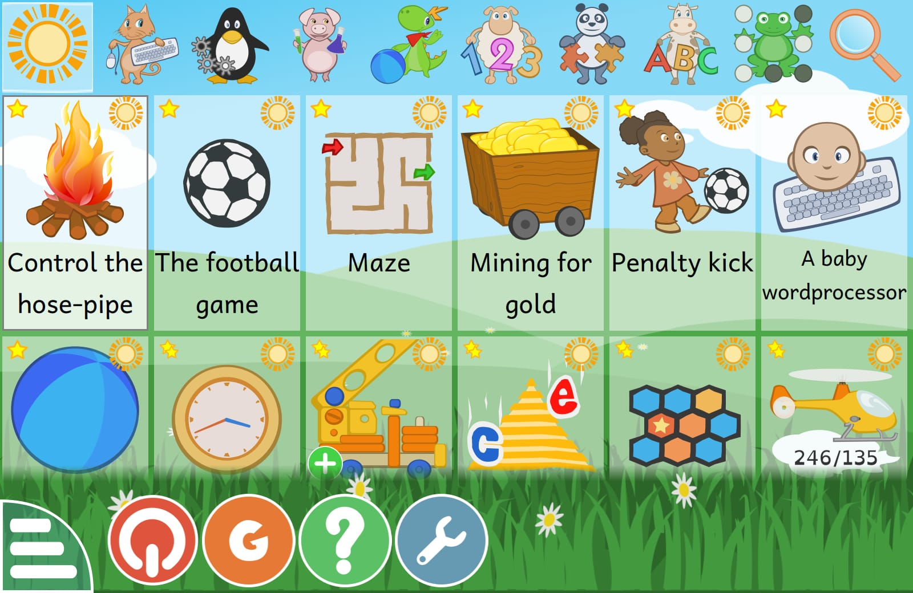

*Students taking part in a learning activity: Math Fruit Catch, on arithmetic sequences.*

Every meaningful learning experience begins with curiosity, and my internship journey at Pthoth, in collaboration with Swami Vivekanand Seva Pratisthan (SVSP), Belagavi, gave me an opportunity to explore how research can contribute to better learning experiences for students.

As this was my first internship, it was an exciting opportunity to step into a professional environment and understand how academic knowledge can be connected with practical work.

I was assigned the role of Researcher and Documentation Intern. My responsibilities involved understanding the objectives of the project, collecting relevant information, studying educational resources, observing learning activities and documenting important findings.

#### Understanding My Role

During the first week, I focused on understanding my responsibilities as a Researcher and Documentation Intern.

I learned that research is not simply about collecting information. It involves exploring different sources, analysing information, identifying relevant points and understanding how the findings can be useful.

Documentation was another important part of my role. I understood the importance of maintaining clear and organised records of research activities, observations and important information so that the work could be reviewed and understood later.

#### Understanding the Research Process

I also started understanding how research connects with classroom learning and educational activities.

I learned that a researcher's responsibility includes looking beyond the teaching content and understanding how students respond to different learning experiences.

Some important aspects I understood were:

- Observing student participation and responses.
- Understanding different teaching and learning approaches.
- Identifying important points during learning activities.
- Recording observations in a structured manner.
- Maintaining proper documentation for future analysis.

#### Learning Through My First Experience

Since this was my first internship, I got an opportunity to understand professional responsibilities, teamwork and the importance of communication.

I realised that research and documentation require patience, attention to detail, critical thinking and consistency. Even a small observation can become valuable when it is properly recorded and analysed.

This week helped me understand that research and documentation go hand in hand. Research helps us discover meaningful information, while documentation helps us preserve and communicate those findings effectively.

#### My Key Takeaway

My first week was an introduction to the world of research and documentation. It helped me understand my responsibilities, develop a research-oriented mindset and recognise the importance of maintaining accurate records.

This was the beginning of my professional journey, and I look forward to learning new things, improving my skills and gaining practical experience throughout my internship.

<strong>👩‍🏫 Mamta Konnuri</strong> — Teacher Intern

## 👩‍🏫 Mamta Konnuri

### My First Week as an Intern: Learning to Listen Before Teaching

I recently started an internship on a research project about how to teach children better through gamified methods. My role is Teacher, and my first week was less about teaching and more about meeting the children and understanding them.

I spent the week introducing myself and interacting with students from 1st to 5th standard. I invited each child to introduce themselves and join in. Some spoke up straight away. Others needed a little time and encouragement, and watching that difference taught me a lot.

#### What I observed

- **Confidence:** Some children were eager to speak, while others hesitated.
- **Participation:** Interest in joining activities varied a lot between age groups.
- **Communication:** Children expressed themselves in very different ways.
- **Attention and interest:** Engagement rose when things felt interactive and fun.
- **Willingness to learn:** Most children were curious. They just needed the right way in.

#### My biggest takeaway

A single teaching style cannot work for children of different ages and levels. A 1st standard student and a 5th standard student need very different approaches, so teaching has to be flexible and student-centred.

My approach this week was simple: **Introduction > Interaction > Observation > Understanding Students.**

I think understanding who you are teaching comes before what you are teaching. This week gave me the foundation for everything the research will build on, including making learning more interactive, visual, and engaging through games and activities.

I am excited for the weeks ahead and grateful for the chance to learn from the children as much as I teach them.

#Internship #Education #GamifiedLearning #TeachingChildren #Research #LearningByDoing #FirstWeek

<strong>👩‍🏫 Zaveriya Baig</strong> — Teacher Intern

## 🎓 Zaveriya Baig

### Teacher Intern at Pthoth & SVSP: Using Educational Technology to Support Learning

*Computer Science Engineering  · Internship start: 
*Pthoth in partnership with Swami Vivekanand Seva Pratisthan (SVSP), Belagavi · 

#### 1. Introduction

Being a Computer Science Engineering student, my college life revolves around programming, technical concepts and academic projects. This internship allowed me to step outside that environment and learn about children, their needs and the role of technology in making learning enjoyable. Teaching, I discovered, is not just explaining a topic; it means knowing students, identifying their problems, choosing the mode of learning and adapting to their needs.

#### 2. Objectives of the Internship

- To understand how educational technology can be chosen and used with the learner's needs in mind.
- To plan and conduct learning sessions for children of Classes 9 and 10.
- To explore interactive platforms and games for mathematics, science, English and social science.
- To develop communication, teamwork and classroom-management skills.

#### 3. Role and Responsibilities

As a Teacher Intern, my responsibilities were:

- Planning and conducting sessions with researchers Shreya and Nandini
- Exploring educational resources and platforms
- Explaining concepts and encouraging children
- Observing students' difficulties and progress
- Deciding how an activity could run on the available hardware

Preparation proved to be an important part of teaching: I had to be familiar with each resource and anticipate its difficulties. At the same time, much of teaching has to be adapted on the spot.

#### 4. Activities Undertaken

Students showed more interest when learning involved games, activities and illustrations. Every activity was planned with a clear learning purpose, since technology should never be used merely for its own sake. The table below summarises the subjects, topics and platforms.

| Subject | Topics / modules | Platform |
|---|---|---|
| Mathematics | Multiplication and division, rules of signs, order of operations (BODMAS), multi-step problems | MathGames.org, GeoGebra |
| Mathematics | Multiplication, factors and division | PhET Arithmetic |
| Mathematics | Arithmetic progression | MathWorksheetsFun games |
| Science | DC circuits; pH scale | PhET simulations |
| Science | Human heart and blood circulation | SciChamp game and a Kannada video |
| English | Vocabulary, spelling, listening and word games | Games to Learn English, VOA Learning English, Fun English Games |
| Social science | Capital to State | DeshKit games |

##### Mathematics: Order of Operations (Classes 9 and 10)

The main objective of this session was to help students of Classes 9 and 10 understand and apply the order of operations while solving multi-step problems. I prepared it with researchers Shreya and Nandini, and used GeoGebra and MathGames.org.

Before the main topic I assessed the students' basic understanding with simple multiplication and division questions. Some students were not confident with these basic operations, so I adjusted my plan and strengthened them first instead of moving straight to BODMAS. I realised that before introducing a higher-level concept, it is important to check that students have the prerequisite concepts.

I then introduced the rules of signs: when the signs are the same the result is positive, and when they are different the result is negative. After that I introduced BODMAS, demonstrated multi-step problems step by step, let students practise similar problems independently, and finished with game-based practice on MathGames.org.

**Teaching sequence:** Basic operations → rules of signs → BODMAS → multi-step problems → practice → MathGames.org games.

| Sign rule | Result |
|---|---|
| + and + (same signs) | + |
| - and - (same signs) | + |
| - and + (different signs) | - |
| + and - (different signs) | - |

##### GeoGebra: Equations, Order of Operations and Coordinates

For Classes 9 and 10 I used GeoGebra for three topics: solving simple one-step equations, order of operations in multi-step problems, and plotting points on the coordinate plane. Each topic followed the same approach: a real-life example, explanation, GeoGebra demonstration, student interaction or activity, discussion, practice and assessment.

For equations, the objective was that children understand what an equation is and find the unknown value x in a one-step equation. I started with a real-life example: if I have some chocolates and get 3 more, and the total is 8, how many did I have before? Then I introduced x + 3 = 8, explained that x is the unknown, and asked students how they got their answers. If a child found it difficult, I explained again with simpler examples, and ended by giving each student one or two questions to check understanding.

I used simple English, Hindi and Kannada words so the children could follow, and a simple 10-minute pre-test at the start and a 10-minute post-test at the end to check learning. My main aim was that children understand the concept and enjoy learning maths.

##### PhET Arithmetic: Multiplication, Factors and Division

Using the PhET Arithmetic simulation, I explained multiplication through visual representation instead of only formulas. I then introduced factors by giving numbers and asking students to find the possible multiplication pairs, and connected factors with division so they could see that multiplication and division are related. Students solved small challenges themselves in PhET, worked in pairs or groups, and answered a few quick questions at the end.

**Approach:** basic assessment, concept introduction, PhET exploration, guided practice, interactive challenges, quick assessment.

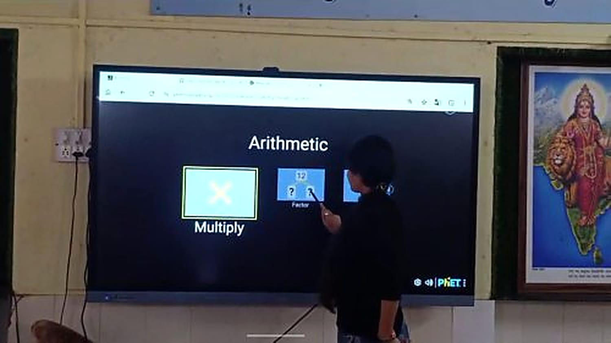

*PhET Arithmetic factors activity on the smart board*

##### Arithmetic Progression and Binary Numbers

For arithmetic progression I started with simple sequences such as 2, 4, 6, 8, 10 and asked students what differs between the terms, so they worked out the common difference themselves. Students then practised on MathWorksheetsFun games (Balloon Pop, Space Shooter, Race Car, Matching Pairs and Pattern Blaster), starting at Easy and moving to Medium or Hard according to performance. After each activity I went over answers and explained errors, especially wrong common differences or patterns.

For binary numbers I used the Binary Bulbs activity on GeoGebra, with 0 as OFF and 1 as ON. I showed examples of converting decimal numbers 0 to 15 into binary, and students switched the bulbs themselves to make each number. The approach was: explain, demonstrate, interactive practice, game, quick assessment.

*Students taking part in a group learning session*

##### Science: DC Circuits, Human Heart and pH

**DC circuits:** students used the PhET Circuit Construction Kit (DC) through interactive, simulation-based learning, building circuits with a battery, wires, resistor and bulb on the smart board.

**Human heart:** I began with simple questions about heartbeat and blood, then showed a Kannada explanation video for basic understanding. Students explored the heart and blood circulation in the SciChamp game, named the heart chambers and followed the path of blood, and I finished with three or four quick questions. Students gained an understanding of the basic structure of the heart and how blood circulates.

**pH scale:** I began with common examples such as lemon juice, water and soap, and briefly introduced acidic, neutral and basic substances. Students explored the PhET pH Scale simulation, observed different pH values and classified substances as acidic, neutral or basic. They came to understand the pH scale and could identify acidic, neutral and basic substances.

*Building a circuit on the smart board with PhET Circuit Construction Kit*

##### English: Testing Free Learning Websites

I tested free English learning websites with children on PCs and touchscreen devices to observe their engagement, ease of use and learning experience.

| Website | Observations |
|---|---|
| Games to Learn English | Children enjoyed vocabulary and spelling games most. Games were simple and interactive with bright visuals. Some younger children needed help reading instructions. |
| VOA Learning English | Audio and videos helped listening skills and pronunciation. Older children were more interested; some lessons were hard for beginners who lacked basic reading skills. |
| Fun English Games | Children enjoyed quizzes, puzzles and word games, which encouraged teamwork. Easy to navigate on PC and touchscreen; some games were challenging for younger children. |

Overall, interactive games kept children interested, they learned new words while having fun, and touchscreens made it easier for younger children to take part. Vocabulary and matching games were the most popular, and many children asked to play again. What did not work as well: some games needed reading instructions first, younger children needed teacher support, and a few advanced activities were less engaging for beginners. These websites can be used regularly to build vocabulary, listening, spelling and communication skills.

*Online adjectives game for English vocabulary*

##### Social Science Sessions for Classes 9 and 10

In the last two weeks I also taught social science to Classes 9 and 10 using free browser games from DeshKit (deshkit.com/games), which cover geography, culture and history and need no sign-up or download. I prepared the lesson plan with researcher Nandini. The main lesson used the Capital to State game, which reverses the usual direction: instead of naming a state's capital, students recall the state from its capital, which is harder.

| Lesson step | What it involved |
|---|---|
| Introduction | Explain the twist: students recall the state from the capital. |
| Demo | Play a few sample questions together on screen. |
| Practice | Students play individually or in pairs and note down the capitals they miss. |
| Peer quiz | Pairs quiz each other using the questions they missed. |
| Exit ticket | Each student writes two questions in the same format. |

Other games from the same site were lined up to extend the topic:

- **Geography:** Capital to State, reversed recall of states and capitals.
- **Culture:** Indian Food to State or Festival to State, linking geography to everyday culture.
- **History:** Freedom Movement Timeline, sequencing key events, useful for Class 10 history and civics.
- **Bonus for faster groups:** Indian States Border Game, spatial recall of state boundaries.

#### 5. Observations about Students

Some students struggled with basic concepts such as multiplication, division and the order of operations. This showed that foundational concepts must be secure before higher-level topics are taught. Every student learns at their own pace: some grasp a concept quickly, while others need more practice and explanation.

**Key observations**

- **What worked:** interactive and game-based activities. Students were more interested when they could solve questions by playing rather than just listening.
- Students participated more when I asked simple questions and involved them directly.
- Using websites and games for practice made sessions more engaging.
- **What did not work:** long explanations and theory-heavy teaching made some students lose interest.
- Some students have weak basics in multiplication, division and basic calculation, so more time is sometimes needed on fundamentals before the main topic.
- **Overall:** a combination of short explanation, activity or game, and practice works best.

#### 6. Challenges Faced

| Challenge | How I handled it |
|---|---|
| Unreliable Wi-Fi; websites load slowly | Used my mobile hotspot as a backup. |
| Smart board gets stuck or glitches | Waited or restarted, or explained the activity orally while it was fixed. |
| Interactive websites take time to load and eat into session time | Opened the websites in advance whenever possible. |
| Students prefer interactive activities over long manual problem solving or quizzes | Let students come to the smart board to play and use the simulations themselves. |
| Not enough laptops for every student | Gave turns one by one or in small groups. |
| Students rush to the smart board at once and do not always follow turn-taking | Called students one by one or in small groups so everyone got a turn. |
| Some students do not listen to instructions and want to start playing | Kept instructions short and explained them while demonstrating on the smart board. |
| Varying learning levels | Gave simple examples and individual help to students who needed basic explanation. |
| Limited Kannada fluency | Used simple English, Hindi and Kannada words, demonstrations and activities, with teammates helping to translate. |

 

#### Resources and Links

| Resource | Link |
|---|---|
| GeoGebra - Equations | [geogebra.org/math/equations](https://www.geogebra.org/math/equations) |
| GeoGebra - Order of operations | [geogebra.org/math/order-operations](https://www.geogebra.org/math/order-operations) |
| GeoGebra - Coordinates | [geogebra.org/math/coordinates](https://www.geogebra.org/math/coordinates) |
| PhET - Circuit Construction Kit (DC) | [phet.colorado.edu/sims/html/circuit-construction-kit-dc](https://phet.colorado.edu/sims/html/circuit-construction-kit-dc) |
| PhET - Arithmetic | [phet.colorado.edu/en/simulations/arithmetic](https://phet.colorado.edu/en/simulations/arithmetic) |
| PhET - pH Scale Basics | [phet.colorado.edu/en/simulations/ph-scale-basics](https://phet.colorado.edu/en/simulations/ph-scale-basics) |
| SciChamp - Circulatory system game | [scichamp.com/circulatory-system-game](https://scichamp.com/circulatory-system-game) |
| MathWorksheetsFun - Arithmetic sequences | [mathworksheetsfun.com/games/9th-grade-games/arithmetic-sequences](https://www.mathworksheetsfun.com/games/9th-grade-games/arithmetic-sequences) |
| Games to Learn English | [gamestolearnenglish.com](https://gamestolearnenglish.com) |
| VOA Learning English | [learningenglish.voanews.com](https://learningenglish.voanews.com) |
| Fun English Games | [funenglishgames.com](https://funenglishgames.com) |
| DeshKit games | [deshkit.com/games](https://deshkit.com/games) |
| MathGames.org | [mathgames.org](https://mathgames.org) |

<strong>🎬 Pavitra Madiwal</strong> — Social Media Manager Intern

## 🎬 Pavitra Madiwal

### Weekly Progress Report: Week 1

*Video Editing, Interactive Games & Emotional Student Engagement · Content Creator*

#### 1. Executive Overview & Key Focus

During Week 1, my core objective as a Content Creator was capturing, editing, and curating interactive learning experiences for young students. By integrating engaging video content with educational digital tools like Toy Theater, we created a vibrant digital environment designed to boost spatial awareness and early childhood engagement.

#### 2. Video Editing & Educational Website Work

Throughout the week, I captured raw classroom footage and edited instructional media showcasing children interacting with interactive display boards. Key accomplishments include:

- **Video Editing & Curation:** Editing high-quality instructional clips highlighting real-time student interactions with digital games.
- **Platform Integration:** Selecting age-appropriate 3D spatial navigation tools on Toy Theater (such as 'Tunnel Rush') to foster fine motor coordination.
- **Interactive Setup:** Configuring smart display boards for direct touch navigation and vibrant visual storytelling.
- **Content Documentation:** Archiving video edits to evaluate student engagement levels and refine future lesson templates.

#### 3. Heartwarming Story: The Joy of Watching Children Learn

**Pure Happiness & Emotional Fulfillment**

As a Content Creator, there is no feeling more rewarding than watching children experience the magic of interactive learning for the first time. During our session with the Toy Theater games on the smart board, the room transformed into a space of pure wonder.

Seeing the children's eyes light up with curiosity as they touched the screen, saw colors respond, and solved interactive puzzles brought overwhelming happiness to all of us. Their genuine laughter, bright smiles, and enthusiastic gasps of joy as they mastered each game fulfilled the core purpose of our work. It reminded us that content creation isn't just about screens—it's about creating moments of pure delight and spark in a child's educational journey.

#### 4. Visual Representation: Interactive Smart Board Setup

The graphic below illustrates the classroom setup featuring the smart display board, interactive 3D web games, and active student engagement.

#### 5. Key Outcomes & Next Steps

Week 1 demonstrated the incredible emotional and cognitive power of interactive media in early childhood education. Key conclusions include:

- **Emotional Engagement:** High enthusiasm and bright smiles confirmed that gamified learning drastically improves attention span.
- **Video Documentation:** Edited footage successfully captured core engagement metrics to guide upcoming lesson development.
- **Upcoming Focus:** Developing collaborative peer-to-peer interactive board tasks for Week 2.

#### 6. Classroom Session Photo

Photograph from the classroom session showing students engaging with the interactive smart board.

*Figure 1.2: Students during the interactive smart board session.*

<strong>🎲 Vinit Lohar</strong> — POC Manager

## 🎲 Vinit Lohar

### Weekly Progress Report: Weeks 1

*Learning Through Play: Our First Two Saturdays at Pthoth Labs*

#### 1. Executive Overview & Key Focus

When we began our Saturday sessions, we weren't only thinking about teaching. We wanted to know whether a child who feels safe, curious, and part of a team learns better. Here is what we saw in the first two weeks.

#### 2. Week 1: Building Trust Before Teaching

Our first Saturday was about connection, not curriculum. We, POC managers, teachers, and researchers talked with the children and introduced themselves. We asked about their names, their favourite things, and what they enjoy doing. **A child who feels safe will speak up, and a child who feels unsafe will stay quiet**. So we spent time making every student feel welcome.

Once the room was relaxed, we introduced web-based games on the smart board. To make it more exciting, we set up a friendly **boys vs. girls mini competition**, and we played alongside the students rather than watching from the side.

The response was wonderful:

- **Laughter & Cheering:** They laughed and cheered as the games went on.
- **Collaboration:** They discussed moves and shared ideas with teammates.
- **Strategy:** They made strategies to outsmart the other team.
- **Active Participation:** Hardly any child sat on the sidelines.

That one session showed us that when learning feels like play, children lean in.

#### 3. Visual Representation: Week 1 Smart Board Games

The photograph below shows students gathered around the smart board during the Week 1 games.

*Figure 1.1: Students and the team playing web-based games on the smart board.*

#### 4. Week 2: From Play to Purposeful Learning

In the second week, we moved from games to learning. We made two changes.

**Smaller Groups**

We divided the students into **two categories based on their classrooms**. With fewer children per group, every student got proper attention and more time to play and explore.

**Demonstration First, Then the Games**

Teachers and researchers introduced an educational topic through a live demonstration, then reinforced it with interactive games on the website.

At the start, many students were not very interested in the explanation. As the session went on, the mood shifted. Students began to answer questions and join the discussion. The number of children responding was still small, but it was a clear improvement, and exactly the kind of gradual change we were hoping to see.

**Free Exploration Time**

After the teaching, students chose the games they wanted to play, with the goal of picking the ones that helped them understand the topic better. This gave them a sense of ownership over their learning, and it showed in their enthusiasm.

#### 5. Visual Representation: Week 2 Interactive Activities

The photographs below show students using interactive games on the smart board.

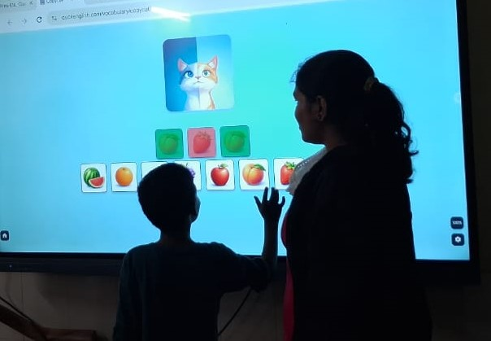

*Figure 2.1: A student and teacher using a matching game on the smart board.*

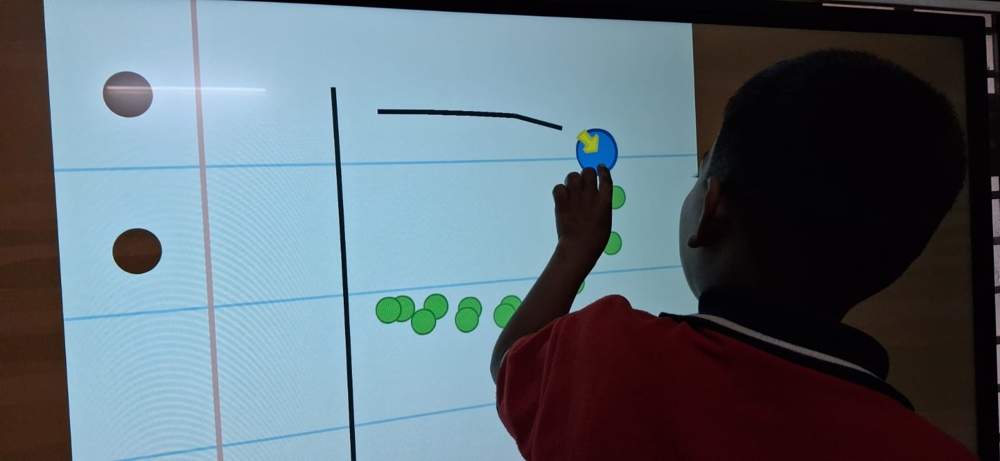

*Figure 2.2: A student interacting with a game on the smart board.*

#### 6. Key Outcomes & What We Learned

- **Trust Comes First:** Children participate more when they feel safe and welcomed.
- **Play Is a Powerful Entry Point:** Games and friendly competition build engagement and teamwork.
- **Smaller Groups Work Better:** Individual attention gives quieter students a chance to join in.
- **Demonstrate, Then Play:** Pairing explanation with interactive practice helped hesitant students begin to participate.
- **Choice Builds Curiosity:** Letting students pick their own games kept them motivated.

> *"When learning feels like play, children lean in."*
 

<strong>📚 Naqeeda </strong> — Researcher & Documentation Intern

## 📚 Naqeeda 

### Weekly Progress Report: Week 1

*Exploring Technology for Interactive Learning · Researcher & Documentation · Class 1–3*

#### 1. Executive Overview & Key Focus

As part of our internship with Swami Vivekanand Seva Pratisthan (SVSP), Belagavi, our Week 1 objective was to explore how technology can make learning more interactive and engaging for children. We used GCompris, an educational software platform, with students from Classes 1–3, focusing mainly on Mathematics and English activities, and observed how the children responded to computer-based learning.

#### 2. GCompris Activities Explored

Throughout the week, we explored different GCompris activities to observe the children's interest, confidence, understanding, and ability to complete tasks with or without guidance. Key activities include:

- **Activity Menu:** The screen where a child chooses what to open next. It depends on reading titles, recognising pictures, and using the mouse or touch confidently.
- **Counting Activity (Turtle Shell):** Children count fruits placed on a green turtle's shell, choose the answer from digits 0 to 9, and press OK. It supports counting, comparing quantities, and linking a digit with the number of objects.
- **Language Support:** Students interacted in Kannada whenever required, showing that simple instructions in their own language matter when introducing technology.

#### 3. What We Observed

**Understanding the Learning Experience**

Students showed interest in the Mathematics and English activities, but their confidence levels differed. Some were comfortable using the activities, while others needed more guidance and support.

Choosing an activity from the menu was not equally easy for everyone. Some students picked an icon on their own, while others waited for us to point one out. The small icons and the amount of English text made this step harder for younger children.

The counting activity was where the link with Mathematics was easiest to see. The pictures and colours held students' attention, and counting objects felt natural to them. Some students needed help to understand what the question mark was asking, and a few were less confident about finding and pressing the correct digit. With guidance, they were able to continue.

#### 4. Visual Representation: GCompris Activity Menu

The screenshot below shows the GCompris activity menu seen during the session, where a child chooses which activity to open.

*Figure 1.1: GCompris activity menu seen during the session.*

#### 5. Key Outcomes & Next Steps

Week 1 showed that an educational tool is not suitable simply because it contains learning activities. Its difficulty level, presentation, interaction, and age suitability must also be considered. Key conclusions include:

- **What worked:** The students showed interest in the Mathematics and English activities.
- **What was difficult:** Some activities were less colourful and less engaging, and certain ones were hard for younger students to complete on their own.
- **Start with the learner:** The needs and abilities of the learners should come first when evaluating an educational resource.
- **Keep it simple for Classes 1–3:** Activities need to be simple, colourful, interactive, and easy to understand.
- **Upcoming Focus:** Exploring simpler, more colourful, and age-appropriate learning solutions for students from Classes 1–3.

#### 6. Counting Activity Screenshot

The counting activity in which fruits are placed on the shell of a green turtle.

*Figure 1.2: GCompris counting activity observed during the session.*

<strong>🤝 Varshini Gudigar </strong> — POC Manager

## 🤝 Varshini Gudigar

### Weekly Progress Report: Week 1

*Beginning My Internship Journey · Point of Contact (POC) Manager*

#### 1. Executive Overview & Key Focus

Starting my internship as a Point of Contact (POC) Manager was a new and exciting experience. My core objective in Week 1 was to communicate with teachers, researchers, and students, understand their experiences, and create a comfortable environment for interaction.

#### 2. Getting to Know the Students

During the first week, we introduced ourselves to the students and tried to get to know them. Key accomplishments include:

- **Friendly Introductions:** Keeping interactions informal so students felt comfortable and could communicate without hesitation.
- **Games & Fun Time:** Talking, playing games, and spending time together to help students feel happy, comfortable, and more confident.
- **Growing Openness:** Seeing students gradually become more open and involved in the activities.

#### 3. Learning Through Games and Fun Activities

**Learning Together**

Learning does not always have to happen in a serious or formal way. Games and fun activities helped us interact with the students more easily and made them more willing to participate.

We also taught the students while learning along with them. Their questions, responses, and ideas made the interactions more interesting and gave us opportunities to learn from them as well. The experience felt less like simply teaching and more like learning and having fun together.

#### 4. Visual Representation: Interactive Screen-Based Activity

The photograph below shows students and volunteers taking part in an interactive screen-based activity.

*Figure 1.1: Students and volunteers taking part in an interactive screen-based activity.*

#### 5. Key Outcomes & Next Steps

As a POC Manager, I encouraged students to express themselves and take part without worrying about making mistakes. I also communicated with teachers and researchers whenever possible, which helped me understand different perspectives. Key conclusions include:

- **Comfort & Confidence:** Friendly, informal introductions help students feel comfortable and confident.
- **Participation:** Games and fun activities make students more willing to participate.
- **Two-Way Learning:** Teaching is a two-way process; we learned from the students' questions and ideas.
- **Safe Space:** A space without fear of mistakes encourages self-expression.
- **Added Perspectives:** Talking with teachers and researchers added valuable perspectives.

> *"Learning becomes more meaningful when we learn, teach and have fun together."*

#### 6. Classroom Session Photo

Photograph from the classroom session showing students seated together, engaged in a group activity led by the team.

*Figure 1.2: Students seated together, engaged in a group activity led by the team.*

<strong>🤖 Vishwas Karikatti</strong> — Teacher Intern

## 🤖 Vishwas Karikatti

### Week 1: My First Internship Begins – Stepping into the Role of a Teacher

*Teacher Intern · Robotics and Artificial Intelligence · Maratha Mandal Engineering College*
*Pthoth, in collaboration with Swami Vivekanand Seva Pratisthan (SVSP), Belagavi*

#### 1. Introduction

My name is Vishwas Karikatti and I am a student of Robotics and Artificial Intelligence at Maratha Mandal Engineering College. I have begun my first internship as a Teacher Intern at Pthoth, in collaboration with Swami Vivekanand Seva Pratisthan (SVSP), Belagavi.

Standing in front of a classroom for the first time changes how you think about learning. Until now I had only been on the receiving end of teaching, and this week I started to see it from the other side. This internship is a step from the world of engineering studies into real, hands-on responsibility, where the aim is to help students understand concepts in a way they can connect with.

#### 2. Objectives

The objectives of my internship, as I understood them in the first week, are:

- To understand what the role of a teacher involves beyond explaining a topic.
- To plan and deliver simple, engaging lessons that students can relate to.
- To make mathematics and general learning enjoyable through activities, games and technology.
- To encourage students to participate, ask questions and learn from their mistakes.
- To develop communication, patience and classroom management skills.
- To experience professional responsibilities such as punctuality, teamwork and receiving feedback.

#### 3. My Role and Responsibilities

I was assigned the role of Teacher Intern. My responsibilities include:

- Preparing lessons and deciding what the students should take away from each session.
- Guiding students through learning activities and interactive tools.
- Using the smart board and online resources to make concepts visual and easy to follow.
- Asking questions, involving the students and observing how they respond.
- Supporting students who find a concept difficult and explaining it in a different way.
- Planning with the team, taking guidance from mentors and acting on feedback.

#### 4. Understanding My Role

In the first week, I focused on understanding what being a teacher actually involves. I realised quickly that teaching is not just explaining a topic. It means knowing your students, adjusting your pace to them, and making sure that what you say is understood and not merely heard.

Coming from a Robotics and Artificial Intelligence background, I am used to thinking in terms of logic, systems and problem solving. I found that the same mindset helps in teaching: break a big idea into small steps, check that each step works, and then build on it.

#### 5. Activities Undertaken

During the first week, the students took part in a range of interactive learning activities in the hall of the Kendra, supported by the smart board and online learning resources.

##### 5.1 Classroom Interaction

Sessions were held with the students seated together on mats in the hall. I used questions throughout the session to keep everyone involved, and the students responded enthusiastically, with many hands going up to answer. Interacting directly with the group helped me see which ideas were clear and which needed another example.

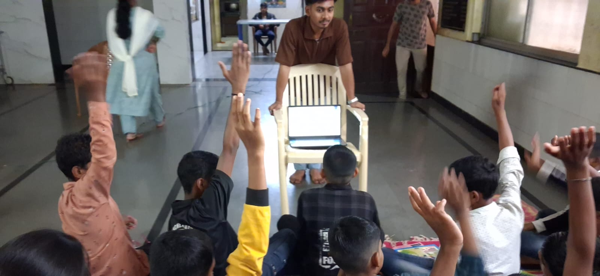

*Figure 1: Students eagerly raising their hands to answer questions during a session.*

##### 5.2 Interactive Simulation: PhET Number Pairs

I used the PhET "Number Pairs" simulation on the smart board so that students could work with numbers visually instead of only listening to an explanation. Students came up to the board one by one and tried the activity themselves, while the rest of the group watched and discussed. Learning by doing kept the students attentive and made the idea easier to remember.

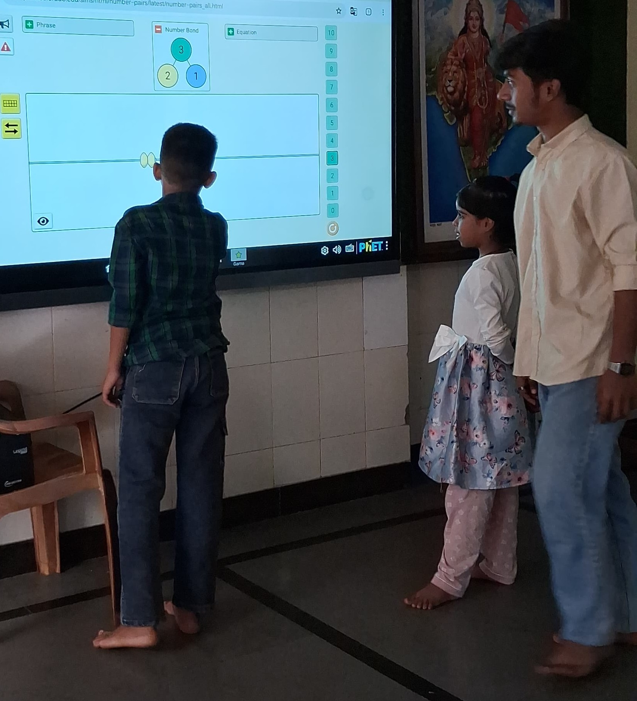

*Figure 3: A student solving the PhET Number Pairs activity on the smart board.*

##### 5.3 Maths Games: Math Playground

To make practice more enjoyable, I explored games from Math Playground that turn algebra into a challenge. In one game, students multiply algebraic terms such as (6y)(−1y) and guide a character to the platform showing the correct answer. In another, a racing game, students solve simple equations such as x − 3 = 2 to move their car forward. These games let students practise skills repeatedly without feeling it is a drill.

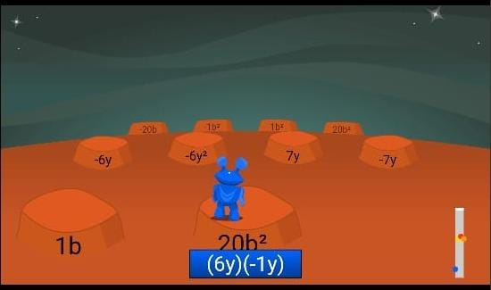

*Figure 4: Multiplying algebraic terms game.*

*Figure 5: Equation-solving racing game.*

##### 5.4 Quizzes and Knowledge Activities

Along with maths, I explored the quizzes, puzzles and videos section of National Geographic Kids as a way to bring general knowledge and curiosity about animals and the world into the learning sessions. Quizzes are a good way to check understanding in a light, low-pressure manner.

#### 6. Preparing and Delivering Lessons

Preparation turned out to be as important as the lesson itself. Before each session, I had to decide what the students should take away, how to introduce the topic simply, and which examples would make it relatable.

Some key things I learned this week:

- Starting with a simple, familiar example before introducing the formal idea.
- Using questions to involve students instead of speaking continuously.
- Keeping explanations short, clear and in plain language.
- Encouraging students to try activities themselves rather than only watch.
- Using games and simulations to turn practice into something students look forward to.
- Watching faces and responses to know when to slow down or repeat.

#### 7. Connecting with Students

The most valuable lesson of the week was about communication. Students respond very differently: some ask questions freely, while others stay quiet even when they are confused. I learned that patience and a friendly approach make students more comfortable, and that a quiet student is not necessarily an understanding one.

I also noticed that mistakes in the classroom are useful. When a student gives a wrong answer, it shows me exactly where the confusion lies, and that helps me explain better the next time.

#### 8. Learning Through My First Experience

Since this was my first internship, I also got a glimpse of professional responsibilities such as punctuality, teamwork, and taking guidance from mentors. Planning with the team and receiving feedback helped me see where I can improve.

I realised that teaching needs patience, clarity, adaptability and confidence. Confidence grows only with practice, and even small improvements, such as asking a better question or giving a clearer example, make a visible difference.

#### 9. Resources and Reference Links

The following links were used as reference and learning resources during the week:

- [Resource 1](https://share.google/0aqfop7T59uAMzGgE)
- [Resource 2](https://share.google/s7UCMz4ZFenalFxzh)

#### 10. My Key Takeaway

My first week was an introduction to the responsibility and joy of teaching. It showed me that a good teacher is not the one who knows the most, but the one who helps others understand. I learned the importance of preparation, patience and clear communication, and I am looking forward to improving my teaching skills, learning from my students, and gaining more practical experience in the weeks ahead.

<strong>🔍 Sneha</strong> — Researcher & Documentation Intern

## 🔍 Sneha 

### Learning to See Beyond What Is Visible

*How an engineering student started learning to observe, record and ask questions in an educational setting · Researcher & Documentation Intern*

**B.E. Robotics and Artificial Intelligence · Maratha Mandal Engineering College**
**Pthoth × Swami Vivekanand Seva Pratisthan (SVSP), Belagavi**

#### 1. Before I Knew What I Was Looking For

I started this internship with the mindset of an engineering student. When I see a problem, I try to understand how the system works. I am Sneha Gurav, a B.E. Robotics and Artificial Intelligence student, and I joined Pthoth × Swami Vivekanand Seva Pratisthan (SVSP), Belagavi as a Researcher & Documentation Intern. My internship takes place in an educational setting inside an ashram/orphanage, and it felt different from college right from the start.

At the beginning, I was not completely sure what I should look for, and that made the experience new for me. I used to think researchers always know exactly what to find. I was only starting, and I had to learn how to begin.

Engineering has taught me to think in a structured way. This internship is teaching me something different: how to observe people and learning environments with more patience and attention.

Looking back, this was a good way to begin. Instead of trying to find answers quickly, I could first learn how to look. I was also entering a place that already had its own way of working, so my role was to understand it, not to judge it.

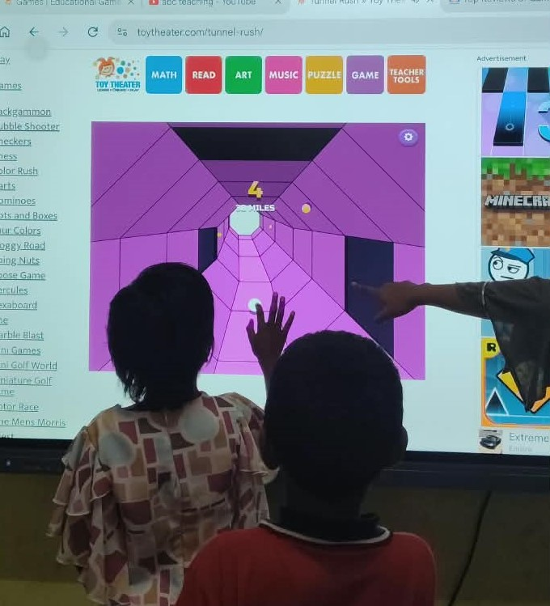

*Figure 1.1: Beginning my journey as a Researcher & Documentation Intern.*

#### 2. Entering a Different Kind of Classroom

The title Researcher & Documentation Intern has two parts. Research means understanding the learning environment and the learning activities. Documentation means recording what I see so that it is not lost.

In a classroom, I have always been a student. Here, my role is different. I pay more attention to the learning environment and to the things I need to observe and record, including the learning activities and how students use the learning tools.

This means I am not at the centre of the experience. I am there to watch carefully, write honestly and avoid quick judgments. Because this is an educational setting, I also try to be respectful in my notes. The students are learners, and my records should be fair to them.

Research is more than collecting information. It needs me to be present and to understand the situation first.

#### 3. Learning to Look Carefully

Observation is not just about seeing what happens. It is about noticing small details and understanding why they matter. I have to decide what is important and remember it clearly enough to write it down.

First impressions come quickly and often feel complete, but they can be wrong. So I try to question them and stay ready to change my opinion when I see more. When I watch learning activities, I try to focus on what actually happens, not on what I expect to happen. This is a habit I am still building, and it is not always easy.

> *Small details can matter more than I first thought.*

Small observations may not look important alone, but together they can show a pattern. That is why I try not to ignore something just because it looks small. Looking carefully also means looking again. After I see something, I try to check whether I understood it correctly.

I also accept that I will not understand everything quickly. Understanding comes step by step, and being open to learning is part of the process. Simple questions help me, like what I should record and why it matters. Research does not start only with answers. It starts with attention and questions.

#### 4. When Notes Became Evidence

Documentation was the next big lesson. I used to think writing notes was a small task done after the real work. Now I see it as part of the real work.

A small observation is easy to forget. It feels clear at that moment, but the details fade after some time. A note written without care may not explain what actually happened. So an observation is useful only when it is recorded clearly and accurately.

I think of documentation as a path with four steps:

**What happened → What I observed → What I understood → What can be researched**

Each step depends on the one before it. If the record is unclear, the observation becomes hard to understand later. If it is clear, I can look at it again, compare it with other observations and use it for research.

I also try to keep what I saw separate from what I think it means. What I saw goes into the record. My understanding comes after that.

Good notes do not need to be long. They need to be clear and accurate, even for someone who was not there. The test I use is simple: if another person reads my note, will they understand what happened? Writing an observation in simple words also shows me whether I have really understood it. When I organize my notes properly, patterns are easier to find, and my observations become useful research material.

#### 5. The Researcher I Was Beginning to Become

My engineering background is still with me. It helps me break a problem into parts and check my understanding. But the internship is showing me another kind of problem-solving: understanding people and learning environments by observing them carefully over time.

I feel more attentive now, and more careful about how I look at situations and what I decide to write down. I also see learning differently. It does not depend only on what is taught, but also on the environment, the activities and how people take part.

I do not want to say that I am an expert researcher, because I am not. I am building the mindset a good researcher needs: looking carefully, recording honestly and being ready to change my first opinion. My early notes may not be perfect, and that is fine, because this stage is about learning how to do it well. Technical knowledge is one skill, and understanding people and situations is another. I want to develop both.

#### 6. Still Learning to Ask Better Questions

Earlier, I thought being prepared meant having answers. This internship is teaching me that it also means knowing how to observe, how to ask questions, and how to record what I find so that others can understand it.

There is still a lot I do not know. My questions will change as I learn more, and I want to improve in simple but important ways:

- **Observing steadily**
- **Writing clearer notes**
- **Organizing my observations better**
- **Asking better questions**

This internship has started to change not only what I do, but also how I look at things.

I am still learning what to look for. But I have started to look.

<strong>🔬 Nandini Dasar</strong> — Researcher & Documentation Intern

## 🔬 Nandini Dasar

### Weekly Progress Report: Week 1

*Classroom Observation & Research · Researcher*

#### 1. Executive Overview & Key Focus

During Week 1, I began my work as a researcher and classroom observer on a project about how children learn best. My role was to watch closely, listen carefully, and step in only when needed to understand each student's learning difficulties and responses. I observed sessions taught by Teacher Zaveriya, noting how students took part, paid attention, understood ideas, and communicated their answers. Students arrived with very different levels of prior knowledge: some grasped concepts quickly, while others needed repeated explanations and simple examples.

#### 2. Teaching Method Observed

Teacher Zaveriya used the **PhET Interactive Simulation, Circuit Construction Kit: DC**, to teach DC circuits. Key features of the activity include:

- **Hands-on Building:** Students built circuits and experimented with components.
- **Instant Feedback:** Results were visible straight away, so students could see the effect of each change.
- **Learning from Mistakes:** The activity encouraged students to try different solutions, spot their own mistakes, and learn from them.
- **Research Alignment:** This kind of curiosity and problem-solving is exactly what our research project hopes to see.

#### 3. Key Observations

- **Participation:** Most students answered questions, used the digital resources, and tried activities on their own.
- **Attention:** Students were most interested when digital tools and practical demonstrations were used.
- **Different Speeds:** Some students could explain their learning independently, while others needed prompts and repeated explanations.
- **Language:** Simple English mixed with Kannada made students more comfortable with instructions and with giving their answers.
- **Peer Support:** Students often solved problems and understood activities better by working with classmates.

#### 4. Biggest Takeaway

Students learn best through simple explanations, real-life examples, visual and digital resources, practical activities, and repeated explanation when required. Because learners move at different speeds and need different levels of support, teaching has to be flexible. Some students were quieter and needed extra encouragement, and a little support made a clear difference to their confidence.

My approach this week was simple: **Observe > Interact > Understand > Learn from Students.**

#### 5. Classroom Session Photo

Photograph from the classroom session showing Teacher Zaveriya conducting a session, observed by Researcher Nandini.

*Figure 1.1: Teacher Zaveriya conducting a session, observed by Researcher Nandini.*

#### 6. Key Outcomes & Next Steps

Combining a teacher's explanation with digital tools and hands-on activities makes concepts easier to understand and improves participation and confidence. Thank you to Teacher Zaveriya for a session that made this so clear.

- **Flexible Teaching:** Different learners need different levels of support.
- **Digital + Practical Learning:** Simulations and demonstrations kept attention high.
- **Upcoming Focus:** Continuing to observe, learn from the students as much as from the classroom itself, and document how support affects confidence in the weeks ahead.

**Tags:** #Research #ClassroomObservation #Education #DigitalLearning #PhETSimulation #ActivityBasedLearning #FirstWeek

<strong>👩‍🏫Soundarya Magdum</strong> — Teacher Intern

## 🎮 Soundarya Magdum

### Learning to See Beyond What Is Visible.

*A classroom journal on swapping worksheets for games*

I went into this internship session with one question: what happens when we swap worksheets for games?

Anyone who has taught young learners knows the problem. Memorizing word lists and filling in worksheets drains attention fast, and in weekend or supplemental classes the students are already tired. Some also get nervous about speaking. So I tried something different with a mixed-level group of young learners.

#### The setup

The whole session ran from one classroom screen. I used duckenglish.com, a free ESL games site with no ads and no logins. That meant no accounts to set up and no devices to hand out. I could jump between activities in seconds while the kids watched and joined in.

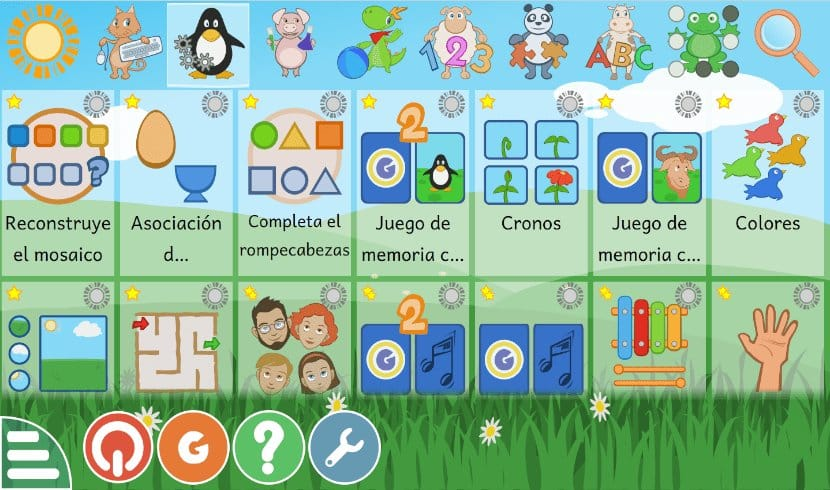

*The game selection screen used during the session*

#### The games

**Copycat** was my warm-up. Students matched pictures by pattern, and it needed almost no instructions, so everyone was in within a minute.

**Pair Up** was a flip-the-cards memory game. Kids had to remember where each picture was and connect it with its vocabulary word.

**Go Bananas** turned out to be a favorite. The class liked it enough to ask to play it again once it was over.

**Spell It** linked word recognition to spelling. I also noticed it works well as an individual follow-up when you want to see how one learner is doing.

**It's Behind You** was my favorite for speaking. One student tried to guess an image while classmates described it. Describing, listening and recalling words all happened at once, and it felt like a real conversation rather than vocabulary drilling.

#### What I noticed

- **Engagement was high.** Students asked to replay Copycat and Go Bananas without any prompting.
- **They enjoyed it.** Bright visuals, character-based elements, matching mechanics and instant feedback all helped.
- **Vocabulary recognition was strongest.** Copycat and Pair Up clearly helped students link pictures with words.
- **Peer interaction grew.** The speaking game made students talk to and listen to each other.

#### What didn't go perfectly

Because everyone watched one guesser at a time, turn-taking needed management. Without a system, some students could end up participating more than others. Quieter students also sometimes needed a gentle nudge during speaking activities.

The shared screen also meant I couldn't capture individual performance data automatically. And I didn't record numerical ratings, student-level data or pre- and post-tests. So I can't claim the games improved learning. What I can say is that they were engaging, and that the approach looks promising as a teaching strategy.

#### What I'd do next time

- Use a visible rotation list or token system so every learner gets a turn.
- Keep a simple record after each session: date, games used and a rough engagement rating.
- Mix group games with short individual tasks, such as Spell It, so I can see each student's progress.
- Take labeled screenshots of the game-selection screens and the gameplay.

#### Final thoughts

This session was a proof of concept rather than a research study. But it showed me that when learning feels like play, students lean in. The next step is pairing that energy with simple tracking, so the fun can be backed up with evidence.

