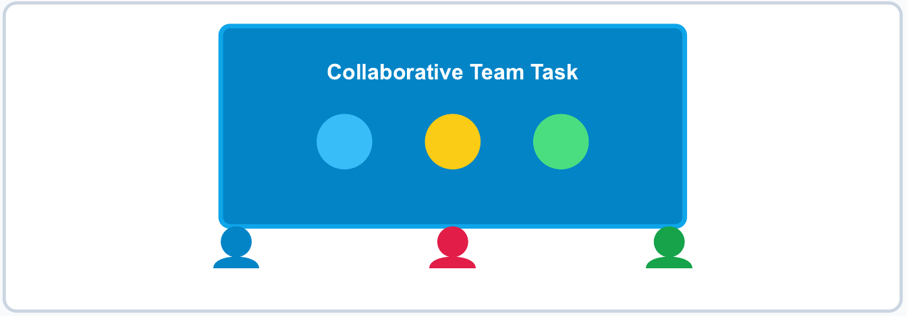
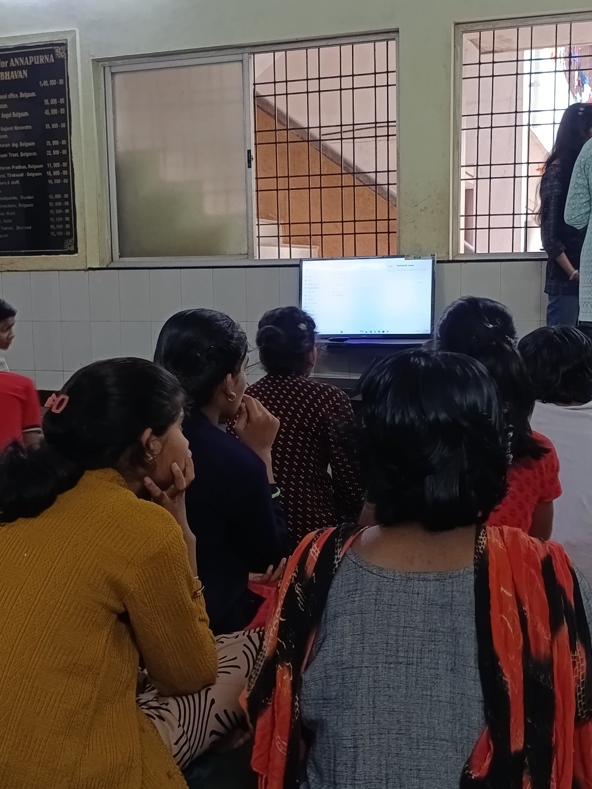
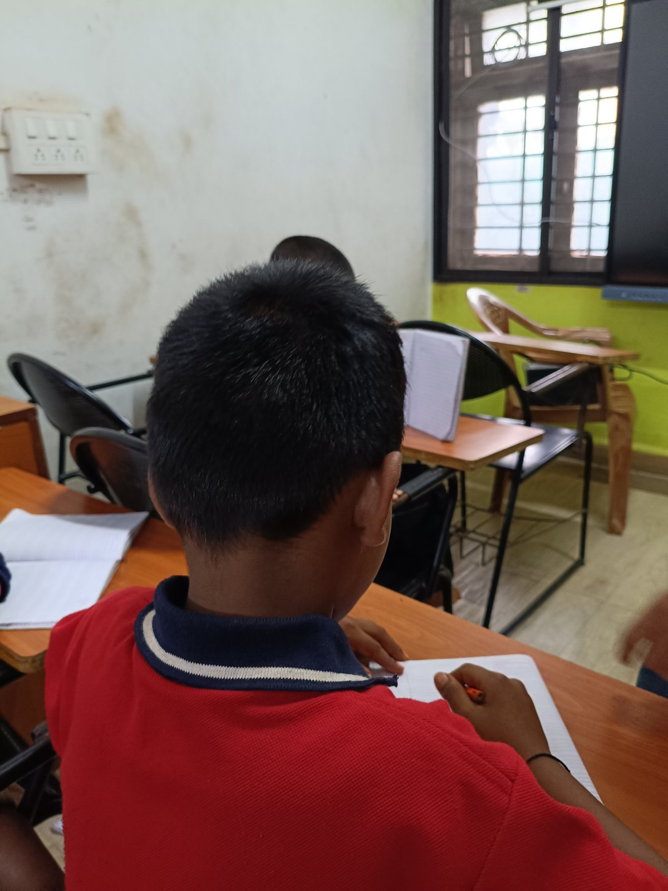

+++
title = "Collaborative Smart Board Learning & Social Interaction"
date = '2026-10-09T22:55:00+05:30'
draft = false
week = 2
weight = 7
contributor = "pavitra-madiwal"
role = "Content Creator"
emoji = "🎬"
+++



## 🎬 Pavitra Madiwal

### Week 2: Collaborative Smart Board Learning & Social Interaction

*Content Creator · Weekly Progress Report, Week 2*

#### 1. Executive Summary

Building on the individual foundations established in Week 1, Week 2 focused on peer-to-peer collaboration and group participation at the interactive display board. As Content Creator, I designed web-based exercises that encourage students to solve interactive puzzles together.

#### 2. Educational Web Tool Integration & Video Capture

During Week 2, we integrated multi-user web modules from educational sites including Toy Theater and ABC Learning. Key tasks accomplished include:

- Designing multi-touch games that allow several children to interact with the board simultaneously.
- Filming student team dynamics to highlight peer guidance and teamwork during game navigation.
- Structuring verbal communication prompts where students explain game solutions to their peers.
- Refining video edits to create engaging highlights of social and collaborative learning.

#### 3. Peer Interaction Dynamics

Introducing team-based interaction at the smart board created an energizing classroom atmosphere. Students supported one another, pointed out game targets, and celebrated shared victories, creating a supportive group environment.

#### 4. Visual Representation: Collaborative Learning Setup

The graphic below shows the multi-student collaborative workflow around the interactive display board.

*Figure 2.1: Multi-Student Smart Board Collaboration. Diagram representing peer interaction at the interactive board, where shared problem-solving builds team spirit and social confidence.*

#### 5. Key Insights & Progress Summary

Group interaction at the interactive display successfully boosted motivation and communication. Key takeaways include:

- **Social Learning:** Group tasks accelerated problem-solving speed through peer cooperation.
- **Content Adaptability:** High-contrast touch zones proved essential for smooth multi-user play.
- **Next Phase Preparation:** Transitioning from big-screen displays to individual laptop workstations in Week 3.

#### 6. Classroom Session Photos

Photographs from the Week 2 classroom session.

*Figure 2.2: Students watching the smart board session.*

*Figure 2.3: A student working during the session.*
