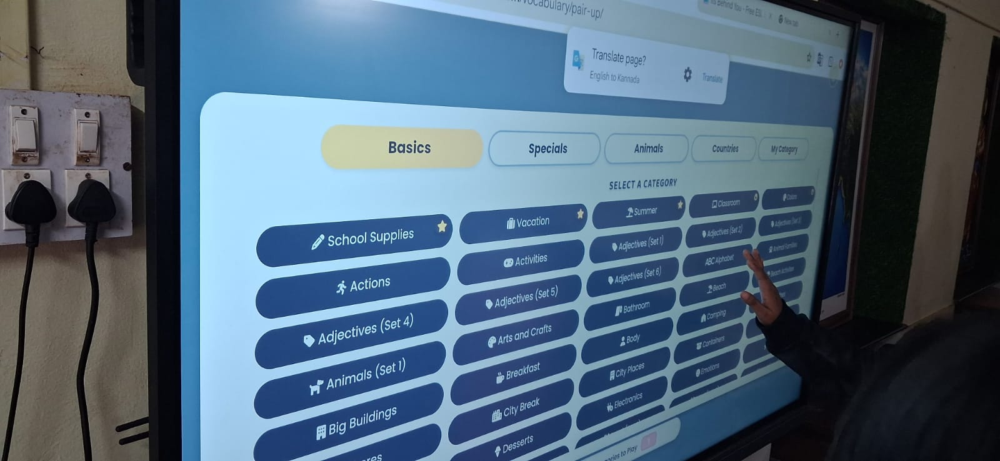
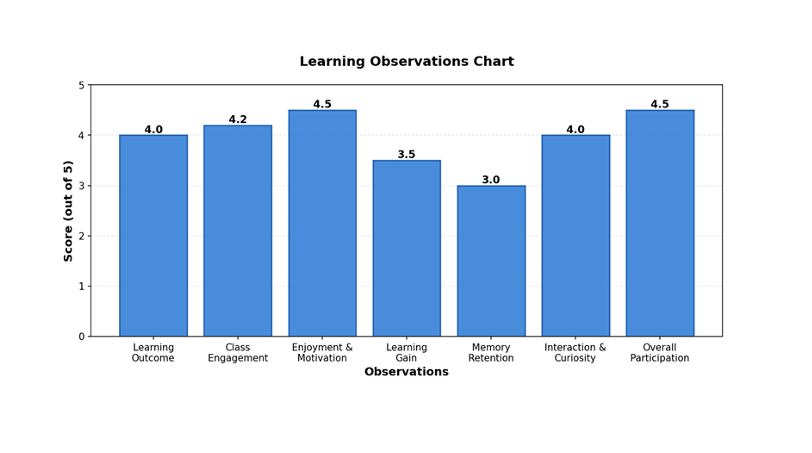

+++
title = "What Enjoyment Cannot Tell Us"
date = '2026-10-09T22:50:00+05:30'
draft = false
week = 2
weight = 12
contributor = "sneha"
role = "Researcher & Documentation Intern"
emoji = "🔍"
+++



## 🔍 Sneha Gurav

### What Enjoyment Cannot Tell Us

*Notes from an adjective activity in which excitement, improvement and understanding did not move together · Researcher & Documentation Intern*

**Robotics and AI student, documentation intern at Pthoth × SVSP**

#### 1. What Was Happening

Ten girls enjoyed the same activity. Four of them clearly understood what it taught. Both statements come from my records, and I spent a long time working out how they fit together.

The activity was about adjectives. Students from Classes 6 to 10 spent about an hour and a half forming phrases, giving their responses aloud and interacting with a digital screen. My role was to observe and document.

*A digital screen showing vocabulary categories that include adjectives.*

The photograph shows that screen: a menu of vocabulary categories, several labelled as sets of adjectives, and a hand reaching towards it. My records do not hold a particular phrase or response that I could describe here, and I would rather not invent one. What they do hold are observations made before and after the activity. This article is built from those.

#### 2. Participation Was Not Identical

Enjoyment was the clearest thing in the room. Students showed excitement as they interacted with the activity.

Not everyone took part in the same way, though. Some students became distracted fairly quickly. Two were shy about answering, and some learned quickly.

The shy students are the ones I was most careful with. When responses are oral, silence leaves little to write down, and it invites an explanation. But a student who is shy about answering has not told me she does not know the answer, and the reasons for her shyness are not in my records. I could record the shyness. I could not record what lay behind it.

The same applies to excitement. A student can be fully absorbed in an activity without understanding what it was meant to teach. Engagement is evidence of engagement.

#### 3. What Changed

Performance after the activity was better than before it. That is the most direct result in my records. Approximately 60% retention was also recorded. I do not have exact before-and-after scores, so I cannot say how large the improvement was.

The chart gives a wider view. It shows my own observation ratings, out of 5, for seven areas of the activity. They are not test scores and they are not standardised or validated measurements. They reflect my judgement from what I recorded.

*Figure 1. My observation ratings, out of 5, across seven areas of the adjective activity. These are my own ratings, not test scores.*

Enjoyment & Motivation and Overall Participation received the highest ratings, 4.5 each, followed by Class Engagement at 4.2. Learning Outcome and Interaction & Curiosity were both rated 4.0, Learning Gain 3.5, and Memory Retention 3.0, the lowest on the chart. As a proportion, 3.0 out of 5 equals 60%, but I am not treating the rating and the 60% figure as two separate confirmations of each other.

The chart does not carry the criteria behind each number, so I read it as a summary of how the activity appeared to me, not as a measurement. What it does show is a pattern: the areas I could most easily see were rated higher than the area that reflects what stayed with the students. It cannot tell me why.

#### 4. Remembering Is Not Understanding

Two other observations complicate that picture. Four students clearly understood the concept that was taught, and applying it was weak.

Better performance and 60% retention suggest that something stayed with the group. Four clear understandings and weak application suggest that, for most of the group, what stayed may not have gone far beyond the activity itself. That is an interpretation, not a finding. It is where the records point, and no further.

It also changed the question I was asking. A correct answer can come from understanding, and it can come from remembering something briefly. Spoken aloud, the two can sound the same.

#### 5. The Details Behind the Group

Some details do not belong on a chart, but they changed how I read it. Two students needed special help with English reading and writing, and some students had difficulty with writing.

In an activity centred on forming phrases, these details matter. My records do not say how they affected any individual result, so I do not connect them to the outcomes. What I can say is that the group was not one group. There were quick learners, students who were easily distracted, two who were shy, and two who needed extra help with reading and writing, all in the same hour and a half.

A single rating for Overall Participation or Learning Outcome had to cover all of them. That is the limit of a summary. It is useful, but it is one number covering experiences that were not the same.

#### 6. A Change in How I Observe

I used to think careful observation meant noticing more. This activity showed me that it also means being clear about what each record can support. Enjoyment can be recorded as enjoyment. Silence can be recorded as silence. A rating can be recorded as my rating. Trouble starts when one is quietly used as proof of another.

What I recorded is the activity as it appeared to me. What each student took from it is a different question, and I am only beginning to learn how to ask it.
