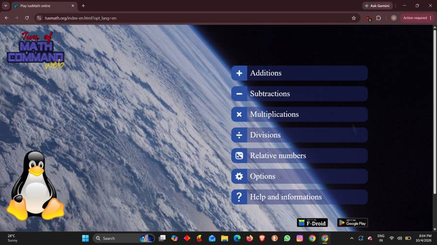
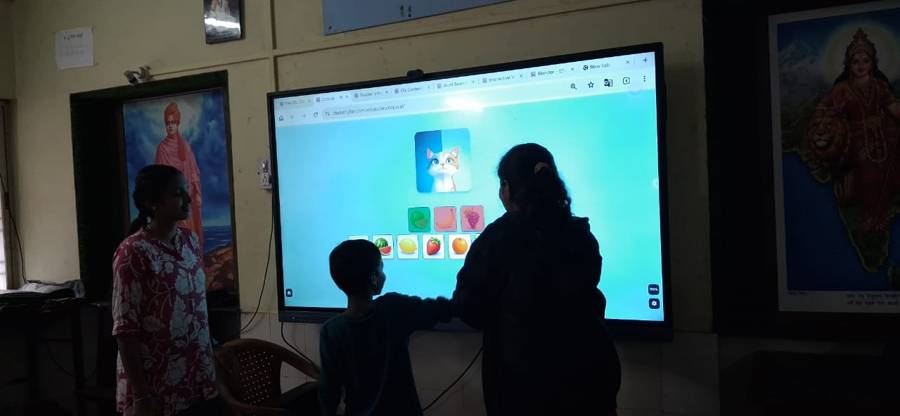
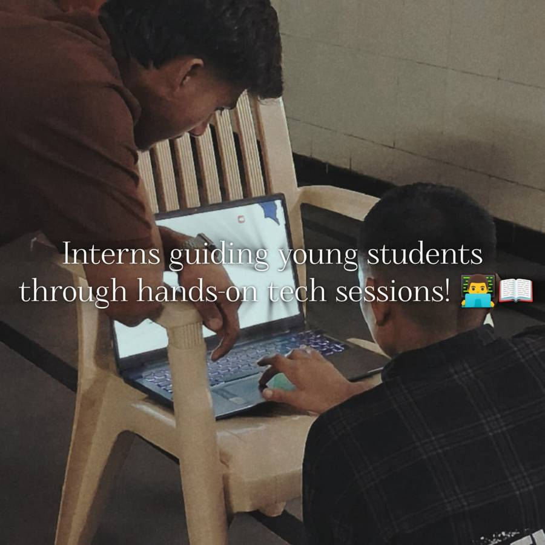
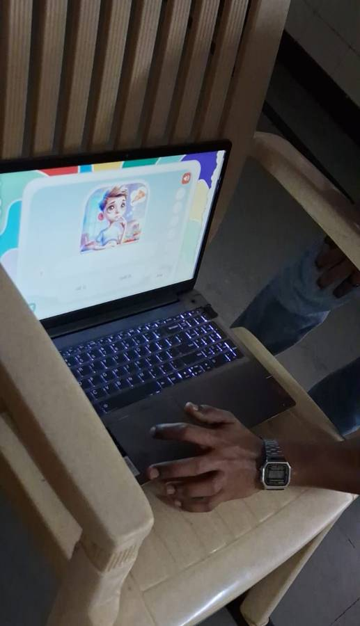

+++
title = "My First Interaction With Students Through TuxMath"
date = '2026-10-09T22:50:00+05:30'
draft = false
week = 2
weight = 1
contributor = "ummehabiba-kotwal"
role = "IT Manager Intern"
emoji = "💻"
+++



## 💻 Ummehabiba Akeelahmed Kotwal

### My First Interaction With Students Through TuxMath

*IT Manager Intern · EdTech Research Internship, Week 2 of 7*

One of the first practical experiences of my internship was interacting with students through an educational game.

We used TuxMath, a mathematics learning game designed to make arithmetic practice more interactive.

*TuxMath's main menu: additions, subtractions, multiplications, divisions and relative numbers.*

Instead of beginning with a traditional explanation, students were introduced to the game and given an opportunity to explore it. Interns guided them while observing how they responded to the activity.

*Students taking part in an interactive learning activity on a classroom display.*

*Interns guiding young students through a hands-on session.*

*An educational English game on a laptop during a student session.*

#### What I Observed

The session helped me understand the difference between simply providing educational software and actually using it as part of a learning activity.

The students showed interest in the game-based format, and the interactive nature of the activity encouraged participation.

For me, this raised an important question:

> **What makes an educational application useful in a real classroom?**

The answer cannot be based only on the number of features an application has.

We also need to consider whether children can understand the interface, whether they enjoy using it, whether it supports the intended learning objective and whether they can eventually use it with less assistance.

#### Understanding the Research Method

Our internship uses a research-oriented approach to classroom activities.

The methodology we discussed can be represented as:

**Observe → Teach → Interact → Involve → Identify → Reinforce → Recall**

This helped me understand that the students' responses themselves are part of the research.

As an IT student, I normally think about software in terms of functionality. This experience made me look at software from the user's perspective as well.

A technically working application may still not be effective if the intended users find it confusing, inaccessible or uninteresting.

#### What I Learned

My first interaction with the students taught me that educational technology should support learning rather than simply replace traditional teaching.

I also learned the importance of observing users before deciding whether a technology solution is appropriate.

That idea became especially useful later when I started evaluating educational websites and applications more systematically.
